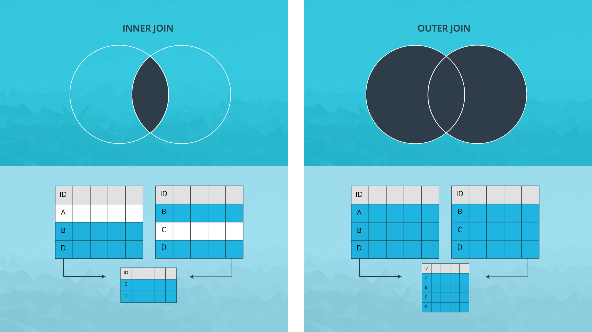
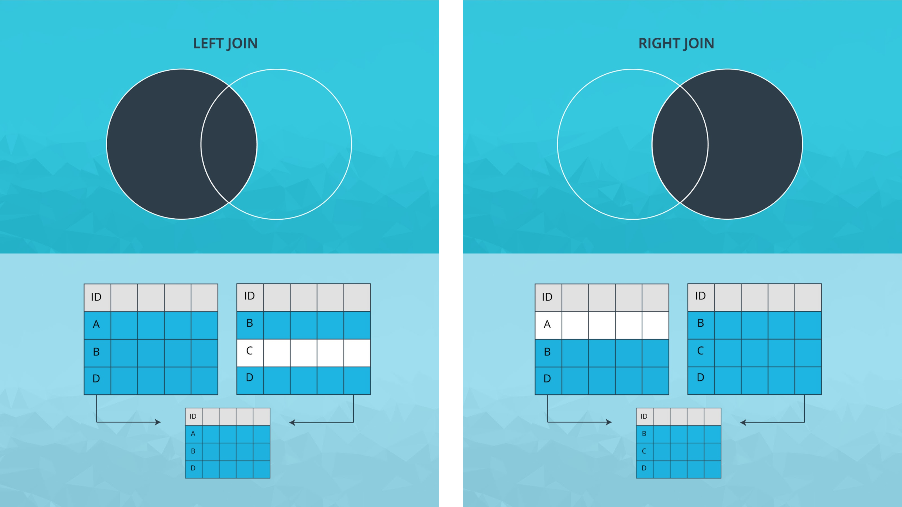

# Data Analysis Process - Case Study 2

In this second case study, you'll be analyzing [fuel economy data provided by the EPA](https://www.epa.gov/compliance-and-fuel-economy-data/data-cars-used-testing-fuel-economy), or Environmental Protection Agency.

### What is Fuel Economy?

Excerpt from Wikipedia [page](https://en.wikipedia.org/wiki/Fuel_economy_in_automobiles) on *Fuel Economy in Automobiles:*

The fuel economy of an automobile is the fuel efficiency relationship between the distance traveled and the amount of fuel consumed by the vehicle. Consumption can be expressed in terms of volume of fuel to travel a distance, or the distance travelled per unit volume of fuel consumed.

### Data Source

Below are the web pages from this video. Note that the datasets we'll be working with are slightly simpler than those found here.

* [EPA Fuel Economy Testing](https://www.epa.gov/compliance-and-fuel-economy-data/data-cars-used-testing-fuel-economy)
* [DOE Fuel Economy Data](http://www.fueleconomy.gov/feg/download.shtml/)

#### Using Documentation to Understand Data

Here are the files you saw in the last video. Use them to help you answer the following questions.

- README.txt [download link](http://www.fueleconomy.gov/feg/epadata/Readme.txt)
- PDF [link](http://www.fueleconomy.gov/feg/EPAGreenGuide/GreenVehicleGuideDocumentation.pdf)

## Types of Merges

So far, we've learned about appending dataframes. Now we'll learn about [Pandas Merges](https://pandas.pydata.org/pandas-docs/stable/merging.html#database-style-dataframe-joining-merging), a different way of combining dataframes. This is similar to the database-style "join." If you're familiar with SQL, this [comparison with SQL](https://pandas.pydata.org/pandas-docs/stable/comparison_with_sql.html#compare-with-sql-join) may help you connect these two.

Here are the four types of merges in Pandas. Below, "key" refers to common columns in both dataframes that we're joining on.

1. Inner Join - Use intersection of keys from both frames.
2. Outer Join - Use union of keys from both frames.
3. Left Join - Use keys from left frame only.
4. Right Join - Use keys from right frame only.

Below are diagrams to visualize each type.

