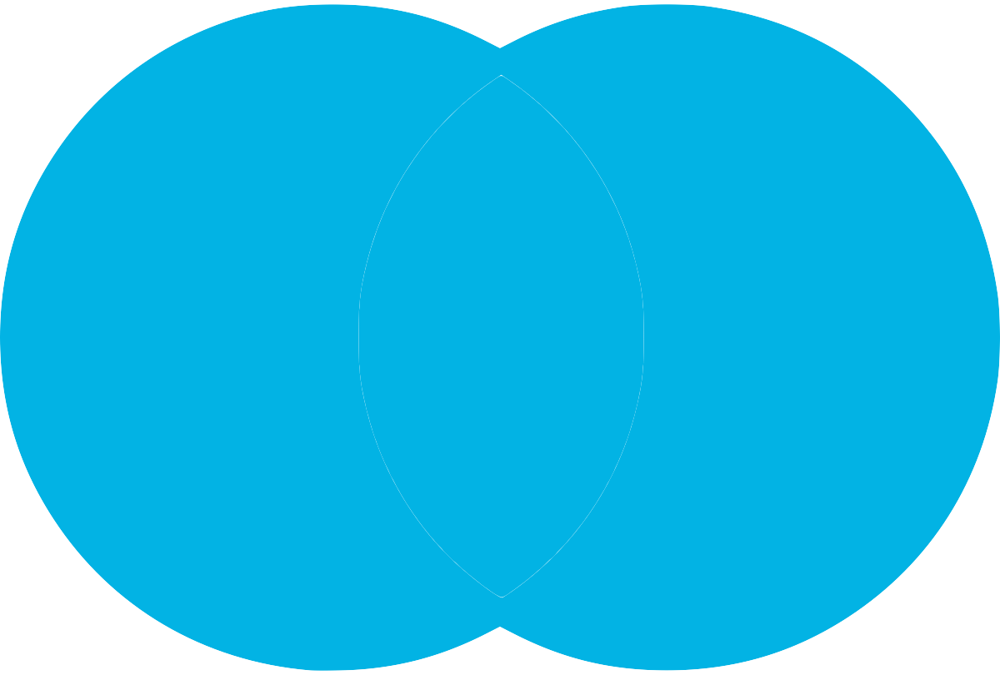

# [Advanced] SQL Advanced JOINs & Performance Tuning


## INNER JOIN

In earlier lessons, we covered inner joins, which produce results for which the join condition is matched in both tables.

*Venn diagrams, which are helpful for visualizing table joins, are provided below along with sample queries. Consider the circle on the left Table A and the circle on the right Table B.*


```SQL
SELECT column_name(s)
FROM Table_A
INNER JOIN Table_B
ON Table_A.column_name = Table_B.column_name;
```


## LEFT JOIN


```SQL
SELECT column_name(s)
FROM Table_A
LEFT JOIN Table_B
ON Table_A.column_name = Table_B.column_name;
```


## RIGHT JOIN

**Right joins** are similar to left joins, but include unmatched data from the right table -- the one that’s indicated in the JOIN clause.


```sql
SELECT column_name(s)
FROM Table_A
RIGHT JOIN Table_B
ON Table_A.column_name = Table_B.column_name;
```

In some cases, you might want to include unmatched rows from both tables being joined. You can do this with a full outer join.


## FULL OUTER JOIN




```sql
SELECT column_name(s)
FROM Table_A
FULL OUTER JOIN Table_B
ON Table_A.column_name = Table_B.column_name;
```

A common application of this is when joining two tables on a timestamp. Let’s say you’ve got one table containing the number of item 1 sold each day, and another containing the number of item 2 sold. If a certain date, like January 1, 2018, exists in the left table but not the right, while another date, like January 2, 2018, exists in the right table but not the left:

- a left join would drop the row with January 2, 2018 from the result set.
- a right join would drop January 1, 2018 from the result set.


If you wanted to return unmatched rows only, which is useful for some cases of data assessment, you can isolate them by adding the following line to the end of the query:

```sql
WHERE Table_A.column_name IS NULL OR Table_B.column_name IS NULL
```


---


## Performance Tuning


One way to make a query run faster is to reduce the number of calculations that need to be performed. Some of the high-level things that will affect the number of calculations a given query will make include:

- Table size
- Joins
- Aggregations

Query runtime is also dependent on some things that you can’t really control related to the database itself:

- Other users running queries concurrently on the database
- Database software and optimization (e.g., Postgres is optimized differently than Redshift)
