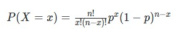

# The Binomial Distribution

The **Binomial Distribution** helps us determine the probability of a string of independent 'coin flip like events'.

The **[probability mass function](https://en.wikipedia.org/wiki/Probability_mass_function)** associated with the binomial distribution is of the following form:  

where:

- `n` is the number of events.
- `x` is the number of "successes.
- `p` is the probability of "success".  

#### We can now use this distribution to determine the probability of things like:  

- The probability of 3 heads occurring in 10 flips.  
- The probability of observing 8 or more heads occurring in 10 flips.  
- The probability of not observing any heads in 20 flips.  
