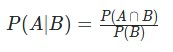
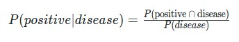

# Conditional Probability

In this lesson you learned about **conditional probability**. Often events are not independent like with coin flips and dice rolling. Instead, the outcome of one event *depends on* an earlier event.

For example, the probability of obtaining a positive test result is dependent on whether or not you have a particular condition. If you have a condition, it is more likely that a test result is positive. We can formulate conditional probabilities for any two events in the following way:  

In this case, we could have this as:  

where:

- `|` represents "given".
- `∩` represents "and".
