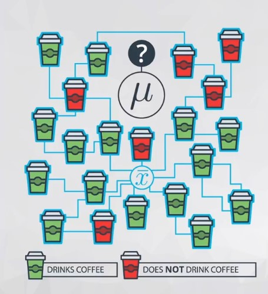
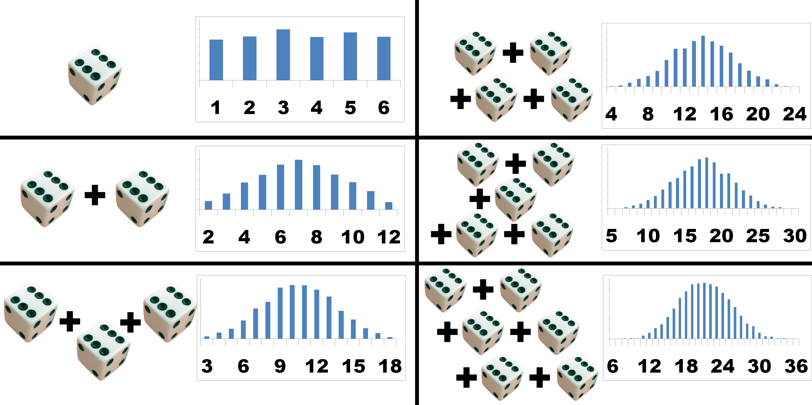
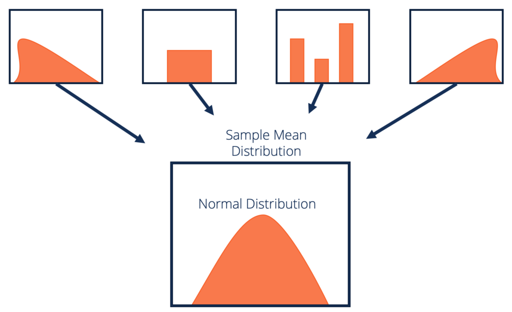
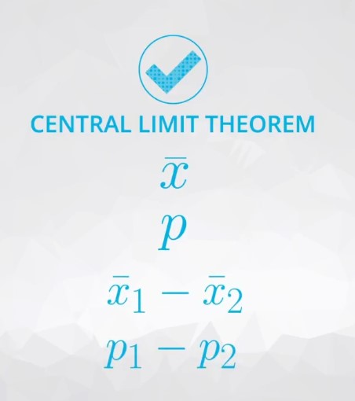

# Sampling distributions and the Central Limit Theorem

**Sampling Distributions** are the distribution of a statistic (any statistic).

#### For proportions (and also means, as proportions are just the mean of 1 and 0 values), the following characteristics hold:
- The sampling distribution is centered on the original parameter value.
- The sampling distribution decreases its variance depending on the sample size used. Specifically, the variance of the sampling distribution is equal to the variance of the original data divided by the sample size used. This is always true for the variance of a sample mean!

In notation, we say if we have a random variable, `X`, with variance of `σ^2`, then the distribution of `Xˉ` (the sampling distribution of the sample mean) has a variance of `σ^2 / n`​

### Two important mathematical theorems for working with sampling distributions include:

- Law of Large Numbers
- Central Limit Theorem

## Law of Large Numbers

The **Law of Large Numbers** says that: **as our sample size increases, the sample mean gets closer to the population mean**, but how did we determine that the sample mean would estimate a population mean in the first place? How would we identify another relationship between parameter and statistic like this in the future?

#### Three of the most common ways are with the following estimation techniques:

1. [Maximum Likelihood Estimation](https://en.wikipedia.org/wiki/Maximum_likelihood_estimation)
2. [Method of Moments Estimation](https://en.wikipedia.org/wiki/Method_of_moments_(statistics))
3. [Bayesian Estimation](https://en.wikipedia.org/wiki/Bayes_estimator)

Though these are beyond the scope of what is covered in this course, these are techniques that should be well understood for Data Scientist's that may need to understand how to estimate some value that isn't as common as a mean or variance. Using one of these methods to determine a "best estimate", would be a necessity.

## Central Limit Theorem

**The Central Limit Theorem** states that: **with a large enough sample size the sampling distribution of the mean will be normally distributed**, but it turns out this is true for more than just the sample mean.

#### The Central Limit Theorem actually applies for these well known statistics:

- Sample means (xˉ)
- Sample proportions (p)
- Difference in sample means (xˉ1 − xˉ2​)
- Difference in sample proportions (p1 - p2​)

And it applies for additional statistics, but it **doesn't apply for all statistics!**.

---
## Bootstrapping

- **Bootstrapping** is a technique where we sample from a group **with replacement**.
-  Using `random.choice` in python actually samples in this way. Where the probability of any number in our set stays the same regardless of how many times it has been chosen.
-  Flipping a coin and rolling a die are kind of like bootstrap sampling as well, as rolling a 6 in one scenario doesn't mean that 6 is less likely later.
- We can use bootstrapping to simulate the creation of sampling distribution, which you did many times in this lesson.
- By bootstrapping and then calculating repeated values of our statistics, we can gain an understanding of the sampling distribution of our statistics.
