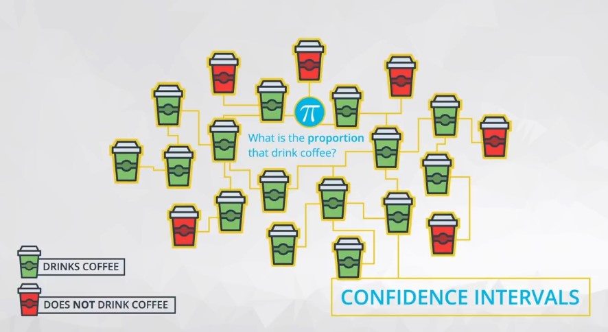
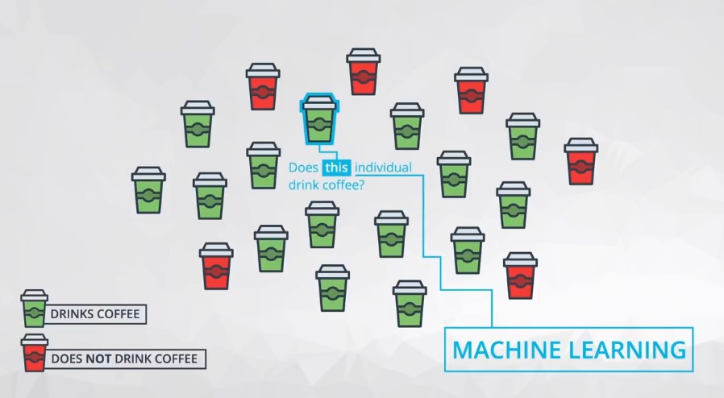

# Confidence Intervals

We can use bootstrapping and sampling distributions to build confidence intervals for our parameters of interest.

By finding the statistic that best estimates our parameter(s) of interest (say the sample mean to estimate the population mean or the difference in sample means to estimate the difference in population means), we can easily build confidence intervals for the parameter of interest.

### We can interpret your confidence interval as:
- We are 95% confident, the `population mean` falls between the bounds that you find.
- we can be 95% confident that the difference in the average heights for coffee drinkers as compared to non-coffee drinkers was in the provided interval of 0.59 to 2.37 inches.

## Statistical vs. Practical Significance

- Using confidence intervals and hypothesis testing, you are able to provide **statistical significance** in making decisions. However, it is also important to take into consideration **practical significance** in making decisions.
- **Practical significance** takes into consideration other factors of your situation that might not be considered directly in the results of your hypothesis test or confidence interval. Constraints like **space**, **time**, or **money** are important in business decisions. However, they might not be accounted for directly in a statistical test.

## Other Language Associated With Confidence Intervals

It is important to understand the way that your sample size and confidence level relate to the confidence interval you achieve at the end of your analysis.

Assuming you control all other items of your analysis:

1. Increasing your sample size will decrease the width of your confidence interval.
2. Increasing your confidence level (say 95% to 99%) will increase the width of your confidence interval.

You saw that you can compute:

1. The confidence interval **width** as the difference between your upper and lower bounds of your confidence interval.
2. The **margin of error** is half the confidence interval width, and the value that you add and subtract from your sample estimate to achieve your confidence interval final results.

## Confidence Intervals (& Hypothesis Testing) vs. Machine Learning

- **Confidence intervals** take an aggregate approach towards the conclusions made based on data, as these tests are aimed at understanding population parameters (which are aggregate population values).

- **Machine Learning** techniques take an individual approach towards making conclusions, as they attempt to predict an outcome for each specific data point.

---
## Recap

In this lesson, We learned:

1. How to use your knowledge of bootstrapping and sampling distributions to create a confidence interval for any population parameter.
2. You learned how to build confidence intervals for the population mean and difference in means, but really the same process can be done for any parameter you are interested in.
3. You also learned about how to use python built-in functions to build confidence intervals, but that these rely on assumptions like the **Central Limit Theorem**.
4. You learned about the difference between **statistical significance** and **practical significance**.
5. Finally, you learned about other language associated with confidence intervals like **margin of error** and **confidence interval width**, and how to correctly interpret your confidence intervals. Remember, confidence intervals are about **parameters** in a population, and not about individual observations.
