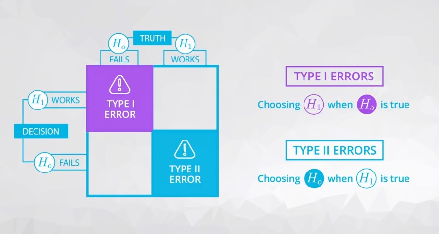

# Hypothesis Testing

Learn the necessary skills to create and analyze the results in hypothesis testing.

## Types of Errors

1. Type I Errors
2. Type II Errors

### Type I Errors
Type I errors have the following features:

1. You should set up your null and alternative hypotheses, so that the worse of your errors is the type I error.
2. They are denoted by the symbol `α`.
3. The definition of a type I error is: **Deciding the alternative (H1​) is true, when actually (H0​) is true**.
4. Type I errors are often called **false positives**.

### Type II Errors

- They are denoted by the symbol `β`.
- The definition of a type II error is: **Deciding the null (H0​) is true, when actually (H1​) is true**.
- Type II errors are often called **false negatives**.

In the most extreme case, we can always choose one hypothesis (say always choosing the null) to ensure that a particular error never occurs (never a type I error assuming we always choose the null). However, more generally, there is a relationship where with a single set of data decreasing your chance of one type of error, increases the chance of the other error occurring.

#### Parachute Example:

This example let you see one of the most extreme cases of errors that might be committed in hypothesis testing.

- In a **type I error** an *individual died*.
- In a **type II error**, you *lost 30 dollars*.

## Common Types of Hypothesis Tests

You are always performing hypothesis tests on population parameters, never on statistics. Statistics are values that you already have from the data, so it does not make sense to perform hypothesis tests on these values.

**Common hypothesis tests include:**

- Testing a population mean [(One sample t-test)](http://sites.utexas.edu/sos/guided/inferential/numeric/claim/one-sample-t/).
- Testing the difference in means [(Two sample t-test)](https://www.isixsigma.com/tools-templates/hypothesis-testing/making-sense-two-sample-t-test/).
- Testing the difference before and after some treatment on the same individual [(Paired t-test)](http://www.statstutor.ac.uk/resources/uploaded/paired-t-test.pdf).
- Testing a population proportion [(One sample z-test)](http://stattrek.com/statistics/dictionary.aspx?definition=one-sample%20z-test).
- Testing the difference between population proportions [(Two sample z-test)](https://onlinecourses.science.psu.edu/stat414/node/268).

**You can use one of these sites to provide a t-table or z-table to support one of the above approaches:**

- [t-table](https://s3.amazonaws.com/udacity-hosted-downloads/t-table.jpg).
- [t-table or z-table](http://www.z-table.com/t-value-table.html).

**There are literally 100s of different hypothesis tests!** However, instead of memorizing how to perform all of these tests, you can find the statistic(s) that best estimates the parameter(s) you want to estimate, you can bootstrap to simulate the sampling distribution. Then you can use your sampling distribution to assist in choosing the appropriate hypothesis.

## What Is A P-value Anyway?

The definition of a p-value is the **probability of observing your statistic (or one more extreme in favor of the alternative) if the null hypothesis is true**.

#### Therefore, you have the following cases:
1. If your parameter is **greater than** some value in the alternative hypothesis, your shading would look like this to obtain your p-value.
2. If your parameter is **less than** some value in the alternative hypothesis, your shading would look like this to obtain your p-value.
3. If your parameter is **not equal** to some value in the alternative hypothesis, your shading would look like this to obtain your p-value.

## Conclusions In Hypothesis Testing

- The word **accept** is one that is avoided when making statements regarding the null and alternative. You are not stating that one of the hypotheses is true. Rather, you are making a decision based on the likelihood of your data coming from the null hypothesis with regard to your type I error threshold.
- Therefore, the wording used in conclusions of hypothesis testing includes: **We reject the null hypothesis** or We **fail to reject the null hypothesis**. This lends itself to the idea that you start with the null hypothesis true by default, and "choosing" the null at the end of the test would have been the choice even if no data were collected.

## Recap

Wow! That was a ton. We learned:

1. How to set up hypothesis tests. You learned the **null hypothesis** is what we assume to be true before we collect any data, and the **alternative** is usually what we want to try and prove to be true.
2. You learned about **Type I** and **Type II** errors. You learned that Type I errors are the worst type of errors, and these are associated with choosing the alternative when the null hypothesis is actually true.
3. You learned that **p-values** are the probability of observing your data or something more extreme in favor of the *alternative* given the* null hypothesis* is true. You learned that using a confidence interval from the bootstrapping samples, you can essentially make the same decisions as in hypothesis testing (without all of the confusion of p-values).
4. You learned how to make decisions based on **[p-values](https://rebeccaebarnes.github.io/2018/05/01/what-is-a-p-value)**. That is, if the p-value is less than your Type I error threshold, then you have evidence to reject the null and choose the alternative. Otherwise, you fail to reject the null hypothesis.
5. You learned that when sample sizes are really large, everything appears **statistically significant** (that is you end up rejecting essentially every null), but these results may not **be practically significant**.
6. You learned that when performing **multiple hypothesis tests**, your errors will compound. Therefore, using some sort of correction to maintain your true Type I error rate is important. A simple, but very conservative approach is to use what is known as a Bonferroni correction, which says you should just divide your `α` level (or Type I error threshold) by the number of tests performed.
