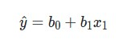

# Regression

In simple linear regression, we compare two quantitative variables to one another.

The **response** variable is what you want to predict, while the **explanatory** variable is the variable you use to predict the response. A common way to visualize the relationship between two variables in linear regression is using a scatterplot. You will see more on this in the concepts ahead.

## What Defines A Line?

A **line** is commonly identified by an intercept and a slope.

The **intercept** is defined as: the predicted value of the response when the x-variable is zero.

The **slope** is defined as:  the predicted change in the response for every one unit increase in the x-variable.

We notate the line in linear regression in the following way:

where:

- y^​ is the predicted value of the response from the line.
- b0​ is the intercept.
- b1​ is the slope.
- x1​ is the explanatory variable.
- y is an actual response value for a data point in our dataset (not a prediction from our line).

# Recap
In this lesson, we learned about simple linear regression. The topics in this lesson included:  

* Simple linear regression is about building a line that models the relationship between two quantitative variables.  
* Learning about correlation coefficients. You learned that this is a measure that can inform you about the **strength** and **direction** of a linear relationship.  
* The most common way to visualize simple linear regression is using a scatterplot.  
* A line is defined by an intercept and slope, which you found using the **`statsmodels`** library in Python.  
* You learned the interpretations for the *slope*, *intercept*, and *R-squared* values.  
