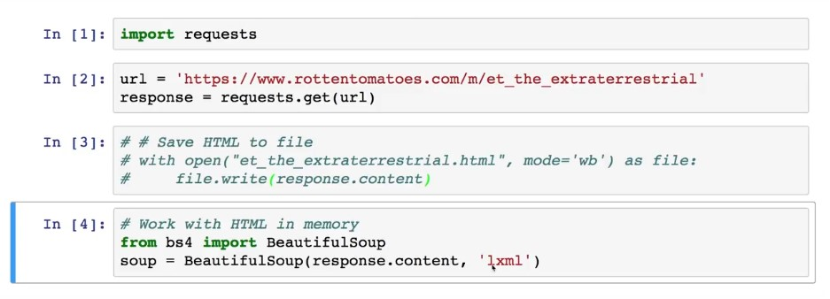

# Gathering Data
Assessing is the *first* step in the data wrangling process.

## Table of contents

- [Data wrangling process](#01)
- [Flat File Structure](#02)
- [Web Scraping](#03)
- [Other File Formats](#04)
- [Resources](#05)

## Data wrangling process: 

1. Gather *(this lesson)*
2. Assess
3. Clean

Depending on the source of your data, and what format it's in, the steps in gathering data vary.

### Gathering:

**Gathering** data is the first step in data wrangling. Before gathering, we have no data, and after it, we do.

Gathering data varies from project to project. Sometimes you're just given data, or pointed to it like I've done for you throughout this course. Sometimes you need to search for the right data for your project. Sometimes the data you need isn't readily available, and you need to generate it yourself somehow. When you do find your data, it's not unusual for it to be spread across several different sources and file formats, which makes things tricky when organizing the data in your programming environment.

For these reasons and more, gathering can be tricky. In this lesson, which is likely the most technically challenging lesson of the course, you'll acquire the coding skills and general craftiness required to conquer the vast majority of gathering scenarios you'll come across in the future. This is going to be hard sometimes, and that's okay. Stick with it and don't hesitate to reach out for help.

#### This lesson will be structured as follows:

- First, we'll pose a few questions.
- Then you'll explore the source of each piece of data we need to answer those questions, each piece from a different source and in a different format.
- Then you'll learn about the structure of each file format.
- Then you'll learn how to handle that file format using Python and its libraries.
- Then you'll actually gather each piece of data to later join together to create your master dataset.

## Flat File Structure 

Flat files contain tabular data in plain text format with one data record per line and each record or line having one or more fields. These fields are separated by delimiters, like *commas*, *tabs*, or *colons*.

#### Advantages of flat files include:

- They're text files and therefore human readable.
- Lightweight.
- Simple to understand.
- Software that can read/write text files is ubiquitous, like text editors.
- Great for small datasets.

#### Disadvantages of flat files, in comparison to relational databases, for example, include:

- Lack of standards.
- Data redundancy.
- Sharing data can be cumbersome.
- Not great for large datasets (see "When does small become large?" in the Cornell link in More Information).

## Web Scraping 

The two main ways to work with HTML files are:

1. Saving the HTML file to your computer (using the `[Requests](http://docs.python-requests.org/en/master/)` library for example) library and reading that file into a `[BeautifulSoup](https://www.crummy.com/software/BeautifulSoup/)` constructor.
2. Reading the HTML response content directly into a `[BeautifulSoup](https://www.crummy.com/software/BeautifulSoup/)` constructor (again using the Requests library for example).

## Other File Formats 

The types of files you mastered in this lesson are the ones you'll interact with for the vast majority of your wrangling projects in the future. Again, these were:

- Flat files (e.g. CSV and TSV)
- HTML files
- JSON files
- TXT files
- Relational database files

Additional, less common file formats include:

- [Excel files](https://www.lifewire.com/what-is-an-xlsx-file-2622540)
- [Pickle files](https://stackoverflow.com/questions/7501947/understanding-pickling-in-python)
- [HDF5 files](http://neondataskills.org/HDF5/About)
- [SAS files](http://whatis.techtarget.com/fileformat/SAS-SAS-program-file)
- [STATA files](http://faculty.econ.ucdavis.edu/faculty/cameron/stata/stataintro.html)

pandas has [functions](http://pandas.pydata.org/pandas-docs/stable/api.html#input-output) to read (and write, to most of them) these files. Also, you now have the foundational understanding of gathering and file formats in general, so learning these additional formats won't be too hard if you need them.

## Resources: 

- [Rotten Tomatoes: Top 100 Movies of All Time](https://www.rottentomatoes.com/top/bestofrt/). Note: this current list may be different than the latest archived list used in this lesson.
- [RogerEbert.com](http://www.rogerebert.com/).
- [Andreas Mueller: Word Cloud Generator in Python](https://amueller.github.io/word_cloud/).
- [Rotten Tomatoes Top 100 Movies of All Time TSV File](https://d17h27t6h515a5.cloudfront.net/topher/2017/September/59ca594d_bestofrt/bestofrt.tsv).
- [Best of Rotten Tomatoes: Critic vs. Audience Scores (Tableau Public Viz)](https://public.tableau.com/profile/david.venturi#!/vizhome/BestofRottenTomatoesCriticvs_AudienceScores/BestofRottenTomatoesCriticvs_AudienceScores).

- Our [short Linux Command Line Basics course](https://www.udacity.com/course/linux-command-line-basics--ud595) (for Linux and Mac users).
- [Navigating the Terminal: A Gentle Introduction](https://computers.tutsplus.com/tutorials/navigating-the-terminal-a-gentle-introduction--mac-3855) by Marius Masalar (for Mac users).
- [Command Prompt - How to use the simple, basic commands](http://www.digitalcitizen.life/command-prompt-how-use-basic-commands) by Codrut Neagu (for Windows users).

- [Professor Excel: XML & ZIP: Explore Your Excel Workbooks File Structure](http://professor-excel.com/xml-zip-excel-file-structure/).
- [Cornell: Relational Databases - Not your Father's Flat Files](https://www.cac.cornell.edu/education/Training/DataAnalysis/RelationalDatabases.pdf).
- [pandas: Flat File Functions](https://pandas.pydata.org/pandas-docs/stable/api.html#flat-file).

- [Towards Data Science: Ethics in Web Scraping](https://medium.com/towards-data-science/ethics-in-web-scraping-b96b18136f01).
- [David Venturi: Screen scraping was the first "magical" thing that drew me to programming](https://twitter.com/venturidb/status/734757220525715456).

- [Stack Overflow: Beautiful Soup and Unicode Problems](https://stackoverflow.com/questions/19508442/beautiful-soup-and-unicode-problems).
- [Stack Overflow: Python: Removing \xa0 from string](https://stackoverflow.com/questions/10993612/python-removing-xa0-from-string).

- **[The Absolute Minimum Every Software Developer Absolutely, Positively Must Know About Unicode and Character Sets (No Excuses!)](https://www.joelonsoftware.com/2003/10/08/the-absolute-minimum-every-software-developer-absolutely-positively-must-know-about-unicode-and-character-sets-no-excuses/)** by Joel Spolsky.
- **[What Every Programmer Absolutely, Positively Needs To Know About Encodings And Character Sets To Work With Text](http://kunststube.net/encoding/)**.
