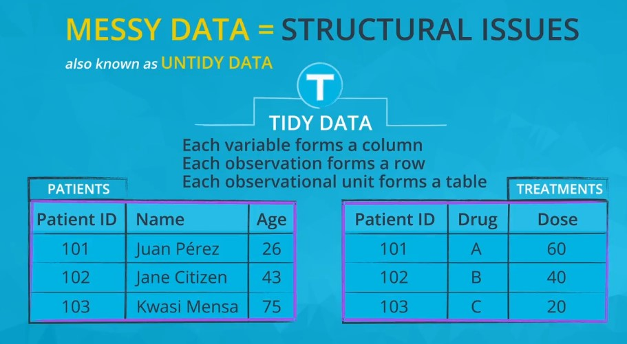

# Assessing Data
Assessing is the *second* step in the data wrangling process.

## Table of contents

- [Data wrangling process](#01)
- [types of assessment](#02)
- [Unclean Data: Dirty vs. Messy](#03)
- [Assessing vs. Exploring](#04)
- [Data Quality Dimensions](#05)
- [Tidy data requirements](#06)
- [Sources of Dirty Data](#07)
- [Sources of Messy Data](#08)
- [Resources](#09)

## Data wrangling process: 

1. Gather
2. Assess *(this lesson)*
3. Clean

### Assessing:

**Assessing** your data is the second step in data wrangling. When assessing, you're like a detective at work, inspecting your dataset for two things:

1. data quality issues (i.e. content issues).
2. lack of tidiness (i.e. structural issues).

Assessing is the precursor to cleaning. You can't clean something that you don't know exists!

## types of assessment: 

1. **Visual assessment**: scrolling through the data in your preferred software application (Google Sheets, Excel, a text editor, etc.).
2. **Programmatic assessment**: using code to view specific portions and summaries of the data (pandas' head, tail, and info methods, for example).

## Unclean Data: Dirty vs. Messy 

There are two types of unclean data:

1. **Dirty data**, also known as *low quality data*. Low quality data has *content* issues.
2. **Messy data**, also known as *untidy data*. Untidy data has *structural* issues.

## Assessing vs. Exploring 

In the context of this dataset, **assessing** is everything you just identified, like spotting:

- Missing HbA1c changes
- Poorly formatted zip codes (e.g., four digits and float data type instead of five digits and string or object data type)
- Multiple state formats (e.g., NY and New York)
- Incorrect patient height values (e.g., 27 inches instead of 72 inches)

**Assessing** is also identifying structural (tidiness) issues that make analysis difficult.

The discovery of these data quality and ensure that the analysis can be executed, which for this clinical trial data includes calculated average patient metrics (e.g. age, weight, height, and BMI) and calculating the confidence interval for the difference in HbA1c change means between Novodra and Auralin patients.

**Exploring**, in the context of this dataset, might be:

- Using summary statistics like `count` on the state column or `mean` on the weight column to see if patients from certain states or of certain weights are more likely to have diabetes, which we can use to exclude certain patients from the analysis and make it less biased

Exploring, in the context of a clinical trial, is less likely to happen given that clinical trials are expensive and consist of extreme pre-planning. So exploring on this dataset would likely exclusively happen before the *treatments* and *adverse_reactions* tables were created, i.e., before the clinical trial was conducted.

## Data Quality Dimensions 

Data quality dimensions help guide your thought process while assessing and also cleaning. The four main data quality dimensions are:

1. **Completeness**: do we have all of the records that we should? Do we have missing records or not? Are there specific rows, columns, or cells missing?
2. **Validity**
: we have the records, but they're not valid, i.e., they don't conform to a defined schema. A schema is a defined set of rules for data. These rules can be real-world constraints (e.g. negative height is impossible) and table-specific constraints (e.g. unique key constraints in tables).
3. **Accuracy**: inaccurate data is wrong data that is valid. It adheres to the defined schema, but it is still incorrect. Example: a patient's weight that is 5 lbs too heavy because the scale was faulty.
4. **Consistency**: inconsistent data is both valid and accurate, but there are multiple correct ways of referring to the same thing. Consistency, i.e., a standard format, in columns that represent the same data across tables and/or within tables is desired.
5. **currency**: the degree to which data is current with the world that it models. Currency can measure how up-to-date data is. Currency is a specific case of accuracy data in the sense that out-of-date data is (usually) valid but wrong. In other words, our definition of accuracy can include currency.

## Tidy data requirements: 

1. Each variable forms a column.
2. Each observation forms a row.
3. Each type of observational unit forms a table.

## Sources of Dirty Data 

*Dirty data = low quality data = content issues*

There are lots of sources of dirty data. Basically, **anytime humans are involved**, there's going to be dirty data. There are lots of ways in which we touch data we work with.

- We're going to have user entry errors.
- In some situations, we won't have any data coding standards, or where we do have standards they'll be poorly applied, causing problems in the resulting data.
- We might have to integrate data where different schemas have been used for the same type of item.
- We'll have legacy data systems, where data wasn't coded when disc and memory constraints were much more restrictive than they are now. Over time systems evolve. Needs change, and data changes.
- Some of our data won't have the unique identifiers it should.
- Other data will be lost in transformation from one format to another.
- And then, of course, there's always programmer error.
- And finally, data might have been corrupted in transmission or storage by cosmic rays or other physical phenomenon. So hey, one that's not our fault.

## Sources of Messy Data  

*Messy data = untidy data = structural issues*

- Messy data is usually the result of poor data planning.
- lack of awareness of the benefits of tidy data. Fortunately, messy data is usually much more easily addressable than most of the sources of dirty data mentioned above.

## Resources  

- [ABBYY: Optical Character Recognition](https://www.abbyy.com/en-ca/finereader/what-is-ocr/).
- The inconsistent data quality dimension research mentioned in the video: [source 1 (PDF)](http://www.damauk.org/RWFilePub.php?&cat=403&dx=2&ob=3&rpn=catviewleafpublic403&id=106193), [source 2](http://www.informit.com/articles/article.aspx?p=399325&seqNum=3), [source 3](http://searchdatamanagement.techtarget.com/definition/data-quality), and [source 4](https://www.youtube.com/watch?v=dPsx8_Fcr-U).
- [Hadley Wickham: Tidying messy datasets](https://cran.r-project.org/web/packages/tidyr/vignettes/tidy-data.html).
-
