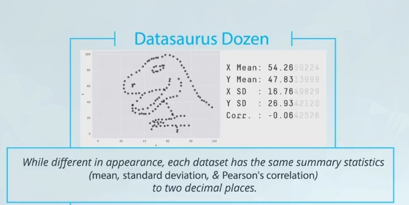
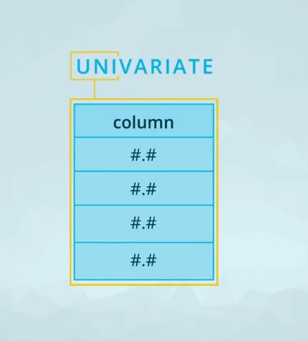
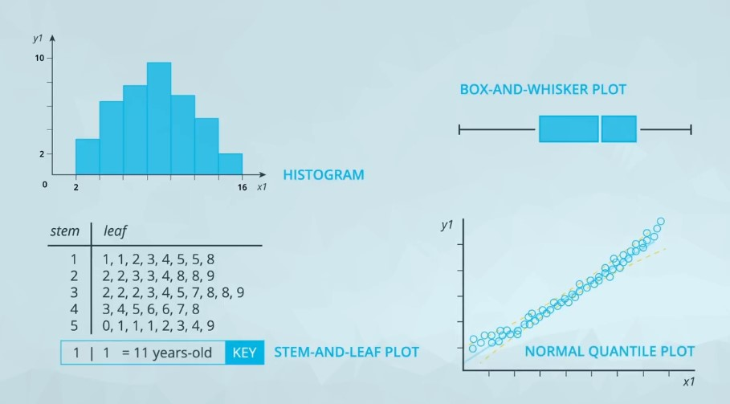
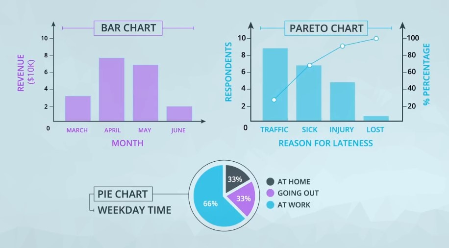
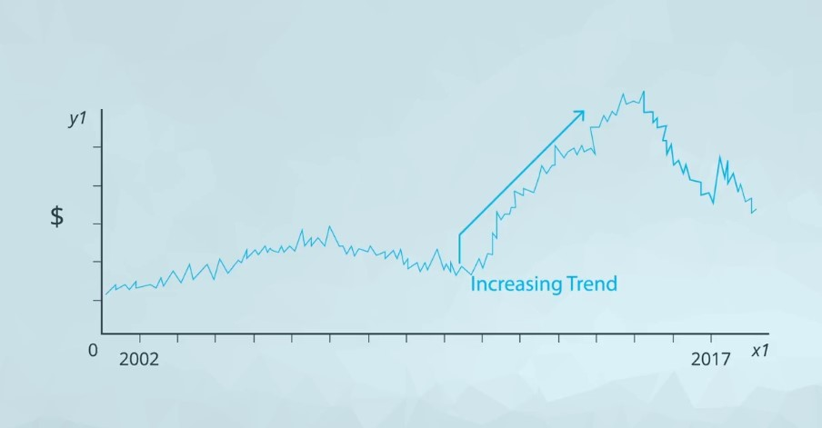

# Introduction to Data Visualization

There are two major areas of focus in this lesson:

1. Why are data visualizations more useful for delivering insight than just using summary statistics?
2. What plot do you build in a given situation?

## Table of content

- [Anscombe's Quartet](#1)
- [Univariate Plots](#univariate)
- [Bivariate Plots](#bivariate)
- [Data Dashboards](#dashboards)
- [Recap](#recap)

## Anscombe's Quartet 

More recently [Alberto Cairo](http://albertocairo.com/) created the [Datasaurus](https://www.autodeskresearch.com/publications/samestats) dataset, which is amazingly insightful and artistic, but is built on the idea that says **"relying on only summary statistics can be misleading"**.

## Univariate Plots 

<!--  -->

For **quantitative** data, if we are just looking at one column worth of data, we have four common visuals:

- Histogram
- Normal Quantile Plot
- Stem and Leaf Plot
- Box and Whisker Plot

In most cases, you will want to use a **histogram**.

For categorical data, if we are looking at just one variable (column), we have three common visuals:

- Bar Chart
- Pie Chart
- Pareto Chart

In most cases, you will want to use a **bar chart**.

## Bivariate plots 

where you were comparing two variables to one another.

For visualizing two **quantitative** variables:

1. [Scatter plots](#scatter)
2. [Line plots](#line)

For visualizing two **categorical** variables:

- the best choice is probably a **side-by-side bar chart**.

### Scatter plots 

Scatter plots are a common visual for comparing **two** quantitative variables. A common summary statistic that relates to a scatter plot is the **correlation coefficient** commonly denoted by **r**.

Though there are a [few different ways](http://www.statisticssolutions.com/correlation-pearson-kendall-spearman/) to measure correlation between two variables, the most common way is with [Pearson's correlation coefficient](https://en.wikipedia.org/wiki/Pearson_correlation_coefficient). Pearson's correlation coefficient provides the:

1. Strength
2. Direction
3. linear relationship

Where we can interpret correlation coefficient as:

of a **linear relationship**. [Spearman's Correlation Coefficient](https://en.wikipedia.org/wiki/Spearman%27s_rank_correlation_coefficient) does not measure linear relationships specifically, and it might be more appropriate for certain cases of associating two variables.

### Line plots 

Line plots are a common plot for viewing data **over time**. These plots allow us to quickly identify:

- overall trends
- seasonal occurrences
- peaks
- valleys in the data.

You will commonly see these used in looking at stock prices over time, but really tracking anything over time can be easily viewed using these plots.

## Data Dashboards 

When We Have Lots of Variables dashboards is the best solution.

**Hans Rosling** shows an amazing visualization that incorporates many variables all at once. [Take a look](https://www.youtube.com/watch?v=jbkSRLYSojo&feature=emb_title) for yourself!

## Recap 

In this lesson:

- You motivated the need for data visualization by showing that summary statistics don't tell the full story. You saw datasets where the summary statistics were the same, but the actual data were very different!

- You did a review of data types. In general there are quantitative and categorical variables. **Quantitative** variables can be either discrete or continuous, while **categorical** variables are either ordinal or nominal.

- You looked at univariate plots. In most cases a **histogram** should be used for quantitative data, while a **bar chart** should be used for categorical data. There are some cases where you might use one of the other plots.

- You then looked at bivariate plots, where you were comparing two variables to one another. **Scatter plots** are the most common way to visualize two quantitative variables, while a **line chart** is common for data that you are watching over time. If you are comparing two categorical variables, the best choice is probably a **side-by-side bar chart**.

- You learned about **correlation coefficients**, which provide the strength and direction of linear relationships. You learned a rule of thumb for determining whether the relationship between two quantitative variables is **strong**, **moderate**, or **weak**.

- You then looked at cases where we had more than two variables. You learned that using these plots effectively is about building the plot that helps you see the insight that answers the question you have.

- You gained some insight into visual encodings and data dashboards, which will be a part of the next lessons!
