# Design

## Table of contents

- [Lesson Overview](#overview)
- [The Data Analysis Process](#da-process)
- [Exploratory vs. Explanatory Analysis](#e-vs-e)
- [What Makes a Bad Visual?](#bad-visuals)
- [Visual Encodings](#visual-encodings)
- [Chart Junk](#junks)
- [Design Integrity](#integrity)
- [Using Color](#colors)
- [Designing for Color Blindness](#blindness)
- [General Design Tips](#tips)
- [Recap](#recap)

---
## Lesson Overview 

You can see one of **Cole's seminars** [here](https://www.youtube.com/watch?v=8EMW7io4rSI). She stresses that **six** lessons of communicating with data:

1. **Understand the context** - this means knowing your audience and conveying a clear message about what you want your audience to know or do with the information you are providing.
2. **Choose an appropriate visual display** - this was covered in the last lesson. Check out the lesson titled recap in the previous section if you need a quick refresher.
3. **Eliminate clutter** - you should only provide information to the user that helps convey your message.
4. **Focus attention where you want it** - build visualizations that pull attention to the message you want to highlight.
5. **Think like a designer** - you will learn a number of design principles in this lesson to assist as you start to put together your own data visualizations.
6. **Tell a story** - your visualizations should give the audience a story. The most powerful data visualizations move people to take action.

<!-- 6 ELEMENTS PIC -->
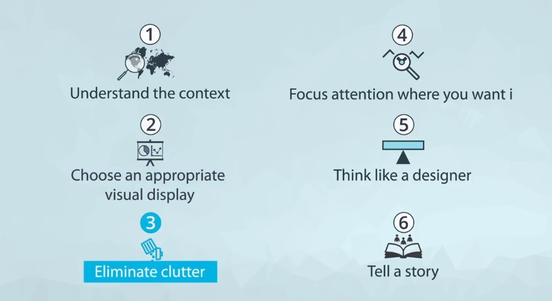

## The Data Analysis Process 

The five steps of the data analysis process:

1. **Extract** - Obtain the data from a spreadsheet, SQL, the web, etc.
2. **Clean** - Here we could use exploratory visuals.
3. **Explore** - Here we use exploratory visuals.
4. **Analyze** - Here we might use either exploratory or explanatory visuals.
5. **Share** - Here is where explanatory visuals live.

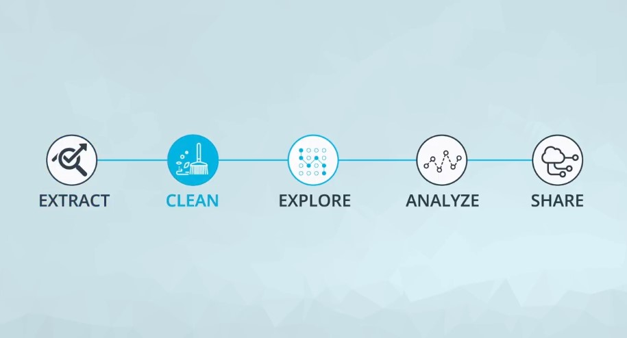

## Exploratory vs. Explanatory Analysis 

There are two main reasons for creating visuals using data:

1. **Exploratory Analysis** - is done when you are searching for insights. These visualizations *don't need* to be perfect. You are using plots to find insights, but they don't need to be aesthetically appealing. You are the consumer, and you need to be able to find the answer to your question from these plots.

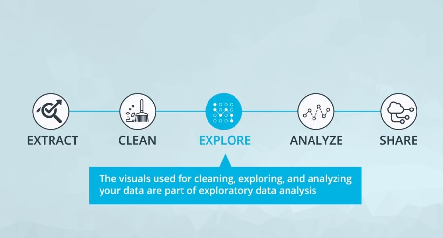

2. **Explanatory Analysis** - is done when you are providing your results for others. These visualizations *need* to provide you the emphasis you need to convey your message. They should be accurate, insightful, and visually appealing.

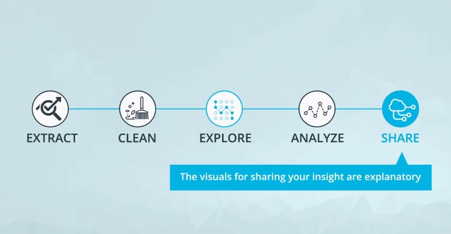

## What Makes a Bad Visual? 

Visuals can be bad if they:

- Don't convey the message.
- Are misleading.

This seems straightforward, but often visuals are created that do one or both of these unintentionally.  
There is an entire book that was published aimed at misleading visuals: [How to Lie with Statistics](http://faculty.neu.edu.cn/cc/zhangyf/papers/How-to-Lie-with-Statistics.pdf).

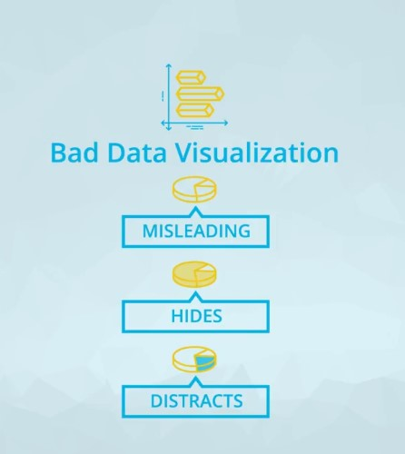

## Visual Encodings 

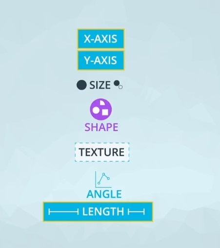

Experts and researchers have determined the visual patterns that allow humans to best identify certain patterns.  
In general, humans are able to **best understand** data encoded with *positional changes* (as we see with scatterplots) and *length changes* (as we see with bar charts).

Alternatively, humans **struggle with understanding** data encoded with *color hue* changes (as is commonly used as an additional variable encoding in scatter plots - this is coming up in the next concepts) and *area changes* (as we see in pie charts).

## Chart Junk 

Chart junk refers to all **visual elements** in charts and graphs that are not necessary to comprehend the information represented on the graph or that distract the viewer from this information.

Examples of chart junk you saw in this video include:

1. Heavy grid lines
2. Unnecessary text
3. Pictures surrounding the visual
4. Shading or 3d components
5. Ornamented chart axes

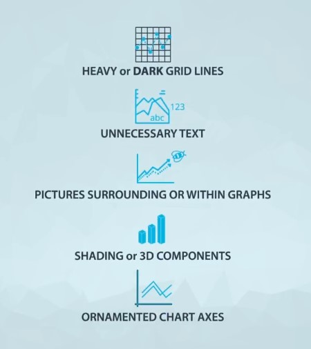

## Design Integrity 

It is key that when you build plots you maintain integrity for the underlying data.

One of the main ways discussed here for looking at data integrity was with the lie factor. The lie factor is calculated in the following way

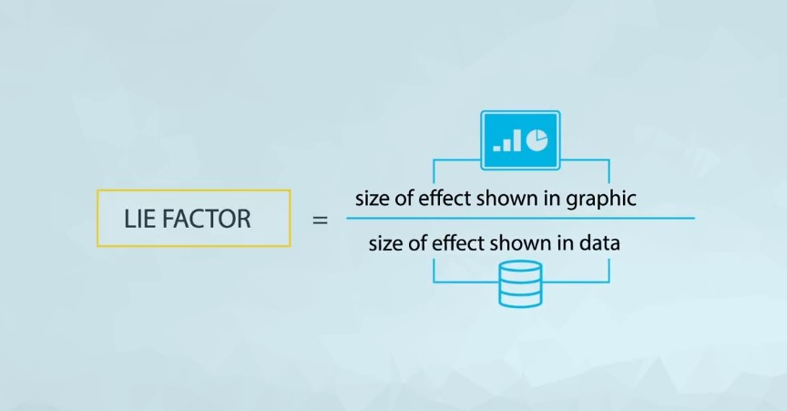

That is the shown relative change in the graphic divided by the actual relative change in the data.

**Example:**

calculating  lie factor by comparing the largest to the smallest doctor in terms of pixels.

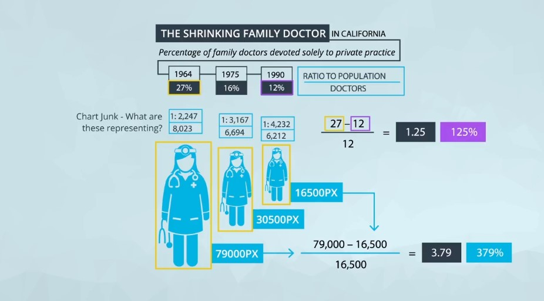

The number of pixels related to the largest image is 79,000 and 16,500 for the smaller. The percentage change is 27% to 12%. So, the lie factor is calculated as:

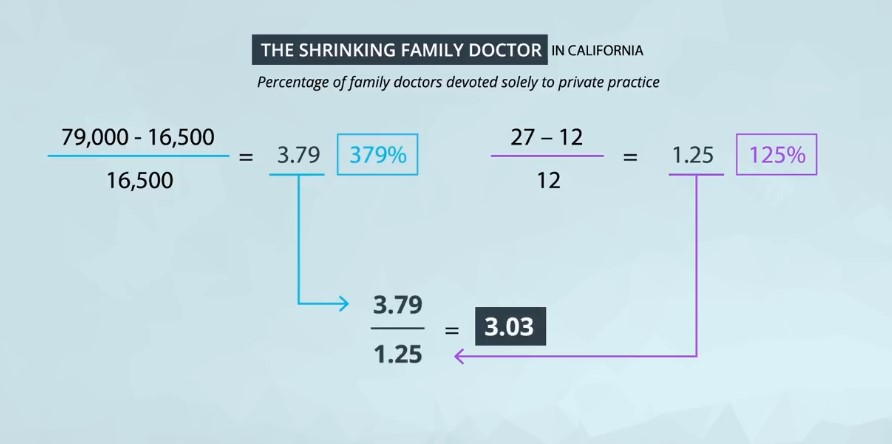

***Any Lie Factor greater than 1 suggests that your visual is misleading, The larger the factor the more misleading the visual.***

#### Further Reading

Flowing Data: [How to Spot Visualization Lies](https://flowingdata.com/2017/02/09/how-to-spot-visualization-lies/).

## Using Color 

Color can both help and hurt a data visualization.  
Three tips for using color effectively.

1. Before adding color to a visualization, **start with black and white**.
2. When using color, **use less intense colors** - not all the colors of the rainbow, which is the default in many software applications.
3. Color for communication. Use color to **highlight your message** and **separate groups** of interest. *Don't add color just to have color in your visualization*.

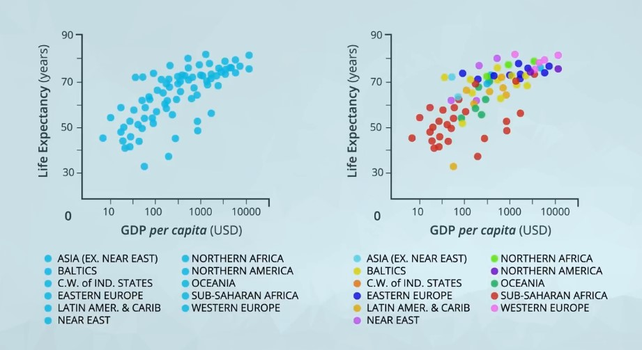

## Designing for Color Blindness 

To be sensitive to those with colorblindness, you should use color pallets that **do not move from red to green** without using another element to distinguish this change like *shape, position, or lightness*. Both of these colors appear in a yellow tint to individuals with the most common types of colorblindness.  

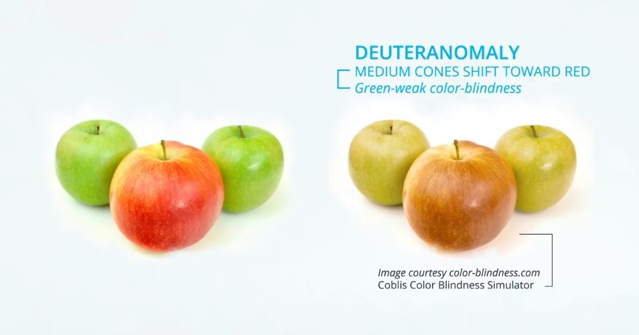

Instead, **use colors on a blue to orange pallet**.

**Tableau Blog**: [5 tips on designing colorblind-friendly visualizations](https://www.tableau.com/about/blog/2016/4/examining-data-viz-rules-dont-use-red-green-together-53463).

## General Design Tips 

Bad visuals can be **avoided** by:

- Maintaining a **large data-ink ratio** and removing unnecessary items from visuals.
- Choosing visual encodings that work to **highlight insights**.
- Maintaining **data Integrity** in the visual.

For **Explanatory** visuals:

- Focus the audience's attention on the insight you want them to act on.
- Use color only when necessary. **Simple is often better**.
- Tell a story.

### Tell a story

Telling stories with data follows these steps:

- Start with a Question.
- Repetition is a Good Thing.
- Highlight the Answer.
- Call Your Audience To Action.

## Recap 

In this lesson, we learned:

- How to build data visualizations for **explanatory** purposes.
- How **visual encodings** impact our abilities as humans to accurately perceive that information.
- How **chart junk** distracts from the message - maximize your data-ink ratio.
- How to calculate **lie factors** and the importance of **design integrity**.
- How to use more **advanced design features** like color, shape, and size - make sure these are truly enhancing your message!
- The importance of **story telling** in communicating with data.
