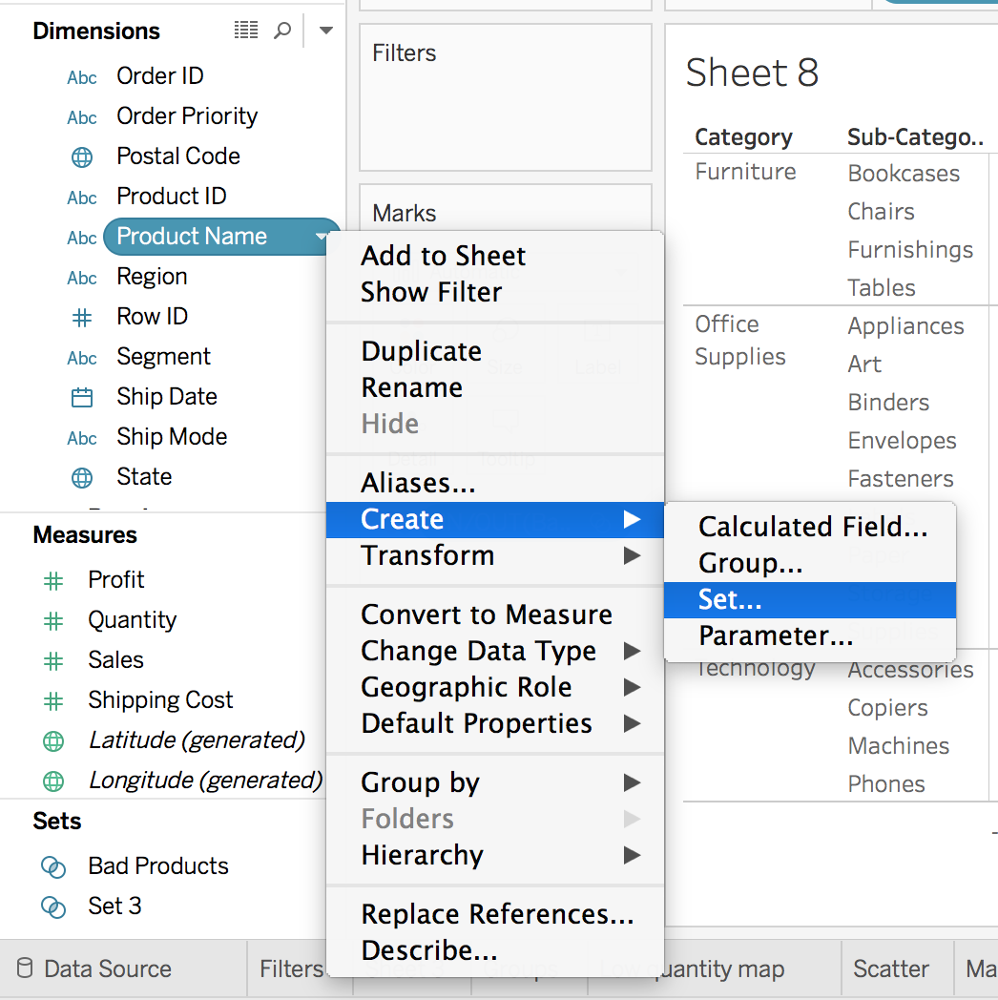

# Data Visualizations in Tableau

There are a lot of ways you can interact with data using **Tableau**. This lesson is going to cover **A LOT** of information. Don't worry if you don't memorize where everything is stored. The goal is to gain familiarity with Tableau, so you aren't afraid to explore beyond the course materials on your own.

Even the below summary might seem overwhelming. It is just here to assist as a nice template of what is to come. Don't worry if you don't follow it all right now. That is what this lesson is for!

## Table of contents

- [Topics Covered](#tc)
- [Commas vs Periods](#cvp)
- [What Can You Create In Tableau?](#using-tableau)
- [Saving to Tableau Public](#saving-tableau)
- [Map Configuration](#map)
- [Groups and Sets](#g-s)
- [Quizzes Plots](#qp)

---
## Topics Covered 

1. **Connecting to Data** - In this section, you will get started with importing data into Tableau. Tableau public has fewer options, but paid versions of Tableau are quite extensive connecting directly to databases and cloud based data storage systems.

2. **Combining Data** - In this section, you will learn how to connect data from multiple sources for use in your visuals. If you are comfortable with SQL joins, this section should be second nature.

3. **Worksheets** - The visuals you create will be stored in worksheets. This is the template we will be working in for this course.

4. **Aggregations** - Tableau performs aggregations of our data by default. In this section, you will learn more about how to work with different aggregations, as well as how to break your aggregations into a more granular level of the data.

5. **Hierarchies** - Hierarchies allow you to 'drill' into your data and questions at different levels. One of the easiest ways to think of hierarchies is in relation to time. You could look at your data at a year, month, day, hour, or another level. Moving across these levels is considered working with hierarchies.

You can also perform hierarchical calculations in other ways. Imagine you have different companies, with different departments, and teams within those departments. This creates a hierarchy that you might want to analyze at different levels.

6. **Marks & Filters** - Filtering is one of the most powerful techniques in creating dashboards. This relates to the marks portion of a dashboard, which controls the colors, shapes and other attributes of our data. You can think of this like a WHERE statement in SQL used to filter your data to only the parts you are interested in for a specific question.

7. **Show Me** - The Show Me portion of Tableau controls what your ending visual looks like. There are a lot of options here. In most cases, Tableau will guess what visual you want to create, but sometimes you might have your own ideas for implementation.

8. **Small Multiples & Dual Axis** - Small multiples & dual charts are a way to visualize data that needs to share an axis for comparison purposes. This and this are great articles for explaining how these two parts of Tableau work and why you might use them.

9. **Groups & Sets** - Groups and sets are two ways to categorize our data within a visualization. The difference between these two can be confusing, but we will see when and why you would use each.

10. **Calculated Fields** - Often you might add these fields to your dataset before adding your data to Tableau, but sometimes you want to add them to a visualization on the fly. Many of these calculated fields are things you have probably done in a spreadsheet application like finding a total or a cost per item.

11. **Table Calculations** - Table calculations are often used to perform comparisons of our data over time or between groups. A great article on table calculations is available [here](https://www.tableau.com/about/blog/2017/2/top-10-tableau-table-calculations-65417).

#### Final Thoughts

These shouldn't feel so daunting anymore. To continue learning about Tableau, definitely feel free to practice any of the previous concepts, but also check out the content on [Tableau](https://www.tableau.com/learn/training). Creating an account is free, and they have a ton of resources to help you continue advancing your skills!

## Commas vs Periods 

A quick note before we get started with Tableau.

Depending on your location, decimals and commas may be treated differently (mostly in European countries) than what you will see in this course.

For this course, we will be using a convention where commas separate large values - like `1,000.00` or `1,000,000.00`. On the other hand, the period will be used as the decimal separator, as you can see from these previous numbers.

#### Potential Solutions:
After importing the data set into Tableau click Sheet 1 tab. Then Click: `File -> Workbook Locale -> English (United States)`.

After making any changes to the settings of Tableau, you may need to restart your computer for the changes to actually go into effect.

## What Can You Create In Tableau? 

There are three main products that you can create using Tableau:

1. Worksheets
2. Dashboards
3. Stories

## Saving to Tableau Public 

* If you are using **Tableau Public**, you will not be able to save to your local machine. In order to save your work, you must save to Tableau Public. In order to do this, you will select `File > Save to Tableau Public`. Then you will need to create an account, and name the workbook. After saving, your visual should appear in your browser.

* If you are using **Tableau Desktop** (only if you have a Tableau License Key), in order to save your work to Tableau Public select `Server > Tableau Public > Save to Tableau Public`. Then you will need to create an account, and name the workbook. After saving, your visual should appear in your browser.

### Common Issues with Saving Files

If you are experiencing an issue saving to **Tableau Public**, the most common issue is fixed by logging out from your profile clicking on your name at the bottom bar, but do not exit tableau. After that click save, login once again, and it should work.

If you are still getting an error, go to data source tab, click the update button and then save.

### Opening Saved Files

In order to open your saved visuals, you will be able to access them from the home screen of Tableau via the **Open from Tableau Public link**.

## Map Configuration 

If you are taking this course outside of the United States, you will need to change your configuration to the United States using the directions linked in the title above in order to achieve the same results as shown in the videos and quizzes.

Link to Tableau's instructions on how to do this: http://onlinehelp.tableau.com/current/pro/desktop/en-us/maps_editlocation.html

## Groups and Sets 

Tableau has two different methods for grouping together data, **groups** and **sets**. They are similar but have differences I'll go over.

Grouping data points together can help illuminate your message. For instance, if you want to point out the products that are losing money, you'd want to create a group of those products and color them separately from the positive profit products.

### Groups:

Groups are typically created from the view by selecting multiple data points in the view. For example, I wanted to look at the average quantity sold and average profits for the countries in the data set.

Now that you have the group created, you can use it in other sheets. For instance, create a map that shows how the low quantity countries are distributed in the world.

### Sets:

Sets are similar to groups in that you can select data points and create a set from them. However, *sets* can be **dynamic** where the members of the set will change as the underlying data changes. *Groups* on the other hand are **static**, the members will always be the members.

For example, say you want to see how your poor performing products are affecting the overall profits. You can create a set from the product names or IDs which lose money, where the average profit is below zero. To create the set, open the menu for the **Product Name** field and choose Create > Set…

This will bring up the menu for editing a set. Click the "Condition" tab. Then select By field: Profit Average < 0 as seen below.

With the set you just made, you can split these bars into losses and gains.

The red bars are showing how much money is lost due to the bad products. It looks like Office Supplies products are almost all winners, but Furniture is losing a lot of money.

## Quizzes Plots 

* Quiz: Marks & Filters I
- **[BarChart1](https://public.tableau.com/profile/mahmoud.reda#!/vizhome/BarChart1_16026099232520/Sheet3)**

* Quiz: Marks & Filters II
- **[LineChart1](https://public.tableau.com/profile/jrreda#!/vizhome/LineChart1_/Sheet4)**
- **[BarChart2](https://public.tableau.com/profile/jrreda#!/vizhome/BarChart2_16026111622700/Sheet5)**
