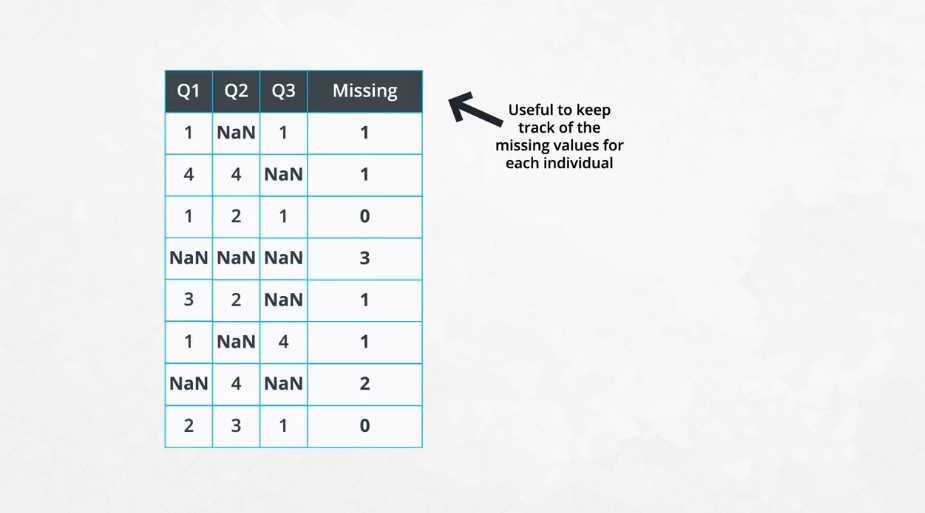
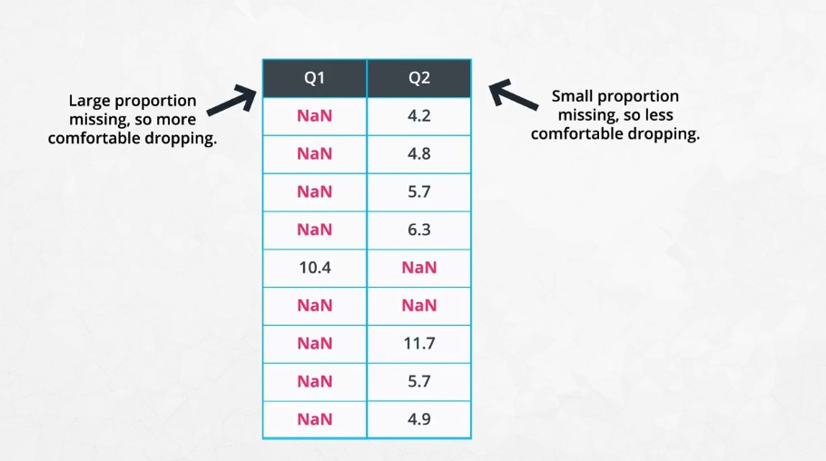
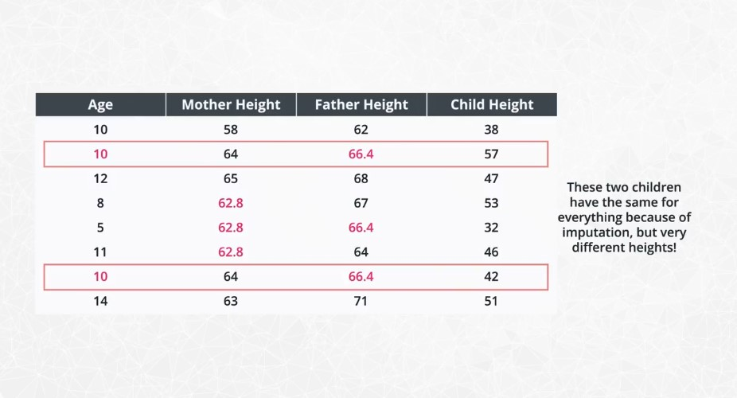
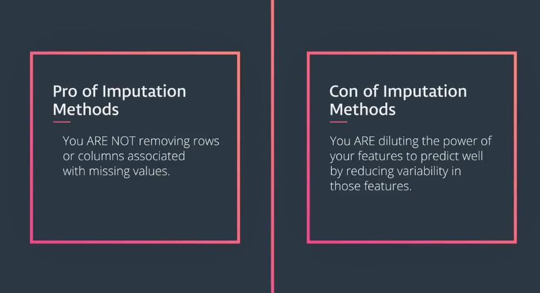
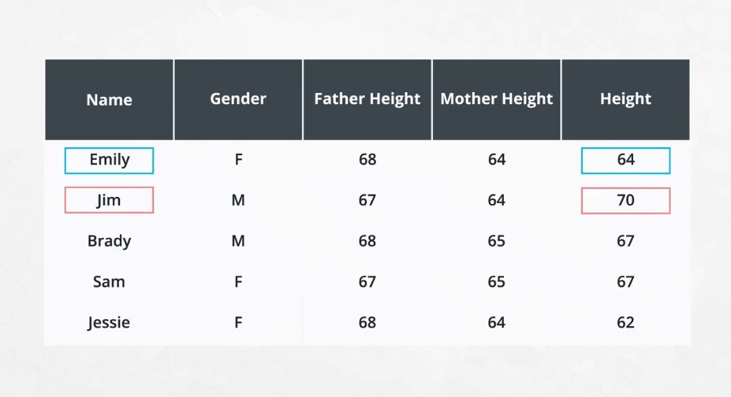

# The Data Science Process

**The CRISP-DM Process (Cross Industry Process for Data Mining)**

The lessons leading up to the first project are about helping you go through CRISP-DM in practice from start to finish. Even when we get into the weeds of coding, try to take a step back and realize what part of the process you are in, and assure that you remember the question you are trying answer and what a solution to that question looks like.

1. [Business Understanding](#1)
2. [Data Understanding](#2)
3. [Prepare Data](#3)
4. [Data Modeling](#4)
5. [Evaluate the Results](#5)
6. [Deploy](#6)

## 1. Business Understanding 

this means **understanding the problem** and questions you are interested in tackling in the context of whatever domain you're working in. Examples include

Examples from StackOverFlow data:

- How do we acquire new customers?
- Does a new treatment perform better than an existing treatment?
- How can improve communication?
- How can we improve travel?
- How can we better retain information?

## 2. Data Understanding 

at this step, you need to move the questions from Business Understanding **to data**. You might already have data that could be used to answer the questions, or you might have to collect data to get at your questions of interest.

Here we used the StackOverflow data to attempt to answer our questions of interest. We did `1.` and `2.` in tandem in this case, using the data to help us arrive at our questions of interest. This is one of two methods that is common in practice. The second method that is common is to have certain questions you are interested in answering, and then having to collect data related to those questions.

#### things you should check about your dataset when getting started:

- Check each column is a variable, and each row is an individual.
- Look at the number of rows and columns in the dataset.
- Check if there are missing values in any of the rows or columns.
- Check if any columns are of different data types than you would expect (ex: numbers showing as strings)
- Build exploratory plots like bar charts, histograms, and scatterplots to better understand the data.

## 3. Prepare Data 

This is commonly denoted as **80%** of the process. You saw this especially when attempting to build a model to predict salary, and there was still much more you could have done. From working with missing data to finding a way to work with categorical variables, and we didn't even look for outliers or attempt to find points we were especially poor at predicting. There was ton more we could have done to wrangle the data, but you have to start somewhere, and then you can always iterate.

### Working With Missing Values

There are two main **'pain'** points for passing data to machine learning models in sklearn:

1. Missing Values
2. Categorical Values

Sklearn does not know how you want to treat missing values or categorical variables, and there are lots of methods for working with each. For this lesson, we will look at common, quick fixes. These methods help you get your models into production quickly, but thoughtful treatment of missing values and categorical variables should be done to remove bias and improve predictions over time.

#### Three strategies for working with missing values include:

1. We can remove (or **“drop”**) the rows or columns holding the missing values.
2. We can **impute** the missing values.
3. We can build models that **work around** them, and only use the information provided.

### 1.1. Removing Data - Why Not?

Though dropping rows and/or columns holding missing values is quite easy to do using numpy and pandas, it is often not appropriate.

Understanding why the data is missing is important before dropping these rows and columns. In this video you saw a number of situations in which dropping values was not a good idea. These included

1. Dropping data values associated with the effort or time an individual put into a survey.
2. Dropping data values associated with sensitive information.

In either of these cases, the missing values hold information. A quick removal of the rows or columns associated with these missing values would remove missing data that could be used to better inform models.

Instead of removing these values, we might keep track of the missing values using indicator values, or counts associated with how many questions an individual skipped.

### 1.2. Removing Data - When Is It OK?

There are other cases in which dropping rows or columns associated with missing values would be okay.

A few instances in which dropping a **row** might be okay are:

- Dropping missing data associated with mechanical failures.
- The missing data is in a column that you are interested in predicting.

Other cases when you should consider dropping data that are **not associated with missing data**:

- Dropping columns with no variability in the data.
- Dropping data associated with information that you know is not correct.

In handling removing data, you should think more about why is this missing or why is this data incorrectly input to see if an alternative solution might be used than dropping the values.

### 1.3. Removing Data - Other Considerations

One common strategy for working with missing data is to understand the proportion of a column that is missing. If a large proportion of a column is missing data, this is a reason to consider dropping it.

There are easy ways using pandas to create dummy variables to track the missing values, so you can see if these missing values actually hold information (regardless of the proportion that are missing) before choosing to remove a full column.

### 2. Imputing Missing Values

Imputation is likely **the most common method** for working with missing values for any data science team. The methods shown here included the frequently used methods of imputing the mean, median, or mode of a column into the missing values for the column.

There are many advanced techniques for imputing missing values including using machine learning and bayesian statistical approaches. This could be techniques as simple as using k-nearest neighbors *(KNN)* to find the features that are most similar, and using the values those features have to fill in values that are missing or complex methods like those in the very popular [AMELIA library](https://cran.r-project.org/web/packages/Amelia/Amelia.pdf).

Regardless your imputation approach, you should be very cautious of the **BIAS** you are imputing into any model that uses these imputed values. Though imputing values is very common, and often leads to better predictive power in machine learning models, it can lead to over generalizations. In extremely advanced techniques in Data Science, this can even mean ethical implications. Machines can only 'learn' from the data they are provided.  
If you provide biased data (due to imputation, poor data collection, etc.), it should be no surprise, you will achieve results that are biased.

**Pros and Cons:**

## 4. Data Modeling 

We were finally able to model the data, but we had some back and forth with step `3.` before we were able to build a model that had okay performance. There still may be changes that could be done to improve the model we have in place. From additional feature engineering to choosing a more advanced modeling technique, we did little to test that other approaches were better within this lesson.

#### Overfitting:

is a common problem when our model does not generalize to data it has not seen before. Assuring you build models that not only work for the data the model was trained on, but also generalize to new (test) data, is key to building models that will be successful to deploy and that will become successful in production.

Overfitting Example:

## 5. Results 

Results are the findings from our wrangling and modeling. They are the answers you found to each of the questions.

## 6. Deploy 

Deploying can occur by moving your approach into production or by using your results to persuade others within a company to act on the results. Communication is such an important part of the role of a data scientist.

#### Two techniques for deploying your results include:

1. Automated techniques built into computer systems or across the web.
2. Communicate results with text, images, slides, dashboards, or other presentation methods to company stakeholders.

As a data scientist, communication of your results to both other team members and to less technical members of a company is a critical component

---
## All Data Science Problems Involve

1. Curiosity.
2. The right data.
3. A tool of some kind (Python, Tableau, Excel, R, etc.) used to find a solution (You could use your head, but that would be inefficient with the massive amounts of data being generated in the world today).
4. Well communicated or deployed solution.

### Extra Useful Tools to Know But That Are NOT Necessary for ALL Projects:

- Deep Learning
- Fancy machine learning algorithms

With that, you will be getting a more in depth look at these items, but it is worth mentioning (given the massive amount of hype) that they do not solve all the problems. Deep learning **cannot** turn bad data into good conclusions. Or bad questions into amazing results.
