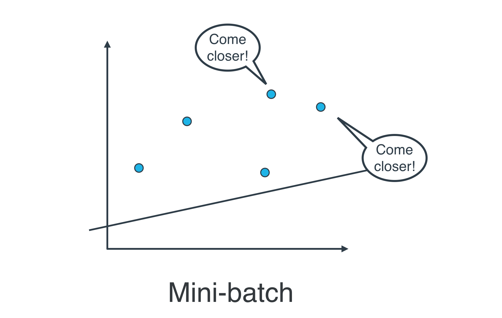

In this lesson, you were introduced to linear models. Specifically, you saw:  

* **Gradient descent** as a method to optimize your linear models.  
* **Multiple Linear Regression** as a technique for when you are comparing more than two variables.  
* **Polynomial Regression** for relationships between variables that aren't linear.  
* **Regularization** as a technique to assure that your models will not only fit to the data available, but also extend to new situations.  


## Batch vs Stochastic Gradient Descent

At this point, it seems that we've seen two ways of doing linear regression.   

* By applying the squared (or absolute) trick at every point in our data *one by one*, and repeating this process many times.  
* By applying the squared (or absolute) trick at every point in our data *all at the same time*, and repeating this process many times.   

More specifically, the squared (or absolute) trick, when applied to a point, gives us some values to add to the weights of the model. We can add these values, update our weights, and then apply the squared (or absolute) trick on the next point. Or we can calculate these values for all the points, add them, and then update the weights with the sum of these values.  

The latter is called batch gradient descent. The former is called stochastic gradient descent.  


***The question is, which one is used in practice?***  

Actually, in most cases, **neither**. Think about this: If your data is huge, both are a bit slow, computationally. The best way to do linear regression, is to split your data into many small batches. Each batch, with roughly the same number of points. Then, use each batch to update your weights. This is still called *mini-batch* gradient descent.  




## Linear Regression Warnings

Linear regression comes with a set of implicit assumptions and is not the best model for every situation. Here are a couple of issues that you should watch out for.  

1. **Linear Regression Works Best When the Data is Linear**  

Linear regression produces a straight line model from the training data. If the relationship in the training data is not really linear, you'll need to either make adjustments (transform your training data), add features (we'll come to this next), or use another kind of model.  


2. **Linear Regression is Sensitive to Outliers**

Linear regression tries to find a 'best fit' line among the training data. If your dataset has some outlying extreme values that don't fit a general pattern, they can have a surprisingly large effect.  

In this first plot, the model fits the data pretty well.  


However, adding a few points that are outliers and don't fit the pattern really changes the way the model predicts.  


In most circumstances, you'll want a model that fits most of the data most of the time, so **watch out for outliers!**


## Feature Scaling

Feature scaling is a way of transforming your data into a common range of values. There are two common scalings:  

1. **Standardizing**  

Standardizing is completed by taking each value of your column, subtracting the mean of the column, and then dividing by the standard deviation of the column. In Python, let's say you have a column in `df` called `height`. You could create a standardized height as:  

``` Python
df["height_standard"] = (df["height"] - df["height"].mean()) / df["height"].std()
```  

This will create a new "standardized" column where each value is a comparison to the mean of the column, and a new, standardized value can be interpreted as the number of standard deviations the original height was from the mean. This type of feature scaling is by far the most common of all techniques (for the reasons discussed here, but also likely because of precedent).

2. **Normalizing**  

With normalizing, data are scaled between 0 and 1. Using the same example as above, we could perform normalizing in python in the following way:  

```Python
df["height_normal"] = (df["height"] - df["height"].min()) / (df["height"].max() - df['height'].min())
```


***When Should I Use Feature Scaling?***  

In many machine learning algorithms, the result will change depending on the units of your data. This is especially true in two specific cases:  

1. When your algorithm uses a **distance based metric** to predict.  
2. When you incorporate **regularization**.  


#### Distance Based Metrics

In future lessons, you will see one common supervised learning technique that is based on the distance points are from one another called [Support Vector Machines (or SVMs)](https://en.wikipedia.org/wiki/Support_vector_machine). Another technique that involves distance based methods to determine a prediction is [k-nearest neighbors (or k-nn)](https://en.wikipedia.org/wiki/K-nearest_neighbors_algorithm). With either of these techniques, choosing not to scale your data may lead to drastically different (and likely misleading) ending predictions.  

For this reason, choosing some sort of feature scaling is necessary with these distance based techniques.


#### Regularization

When you start introducing regularization, you will again want to scale the features of your model. The penalty on particular coefficients in regularized linear regression techniques depends largely on the scale associated with the features.  
When one feature is on a small range, say from `0` to `10`, and another is on a large range, say from `0` to `1,000,000`, applying regularization is going to *unfairly* punish the feature with the small range.  
Features with small ranges need to have larger coefficients compared to features with large ranges in order to have the same effect on the outcome of the data.  
(Think about how *`ab = ba`* for two numbers `a` and `b`.) Therefore, if regularization could remove one of those two features with the same net increase in error, it would rather remove the small-ranged feature with the large coefficient, since that would reduce the regularization term the most.  

Again, this means you will want to **scale features** any time you are applying regularization.   

* [A useful quora post on feature scaling in regularization](https://www.quora.com/Why-do-we-normalize-the-data).  

Another point of discussion in the above article is the fact that feature scaling can also speed up convergence of your machine learning algorithms, which you may have to think about as you scale machine learning applications.
