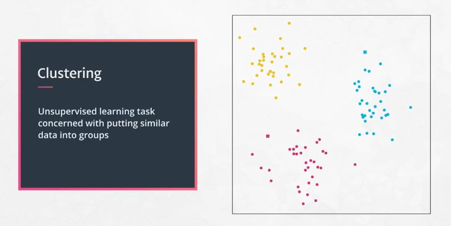
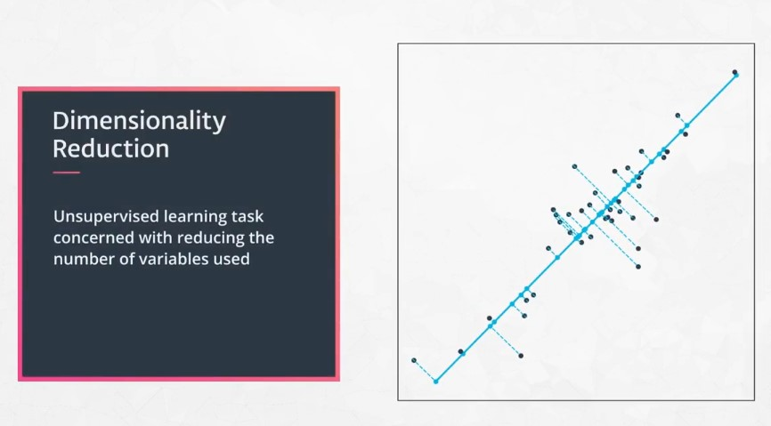
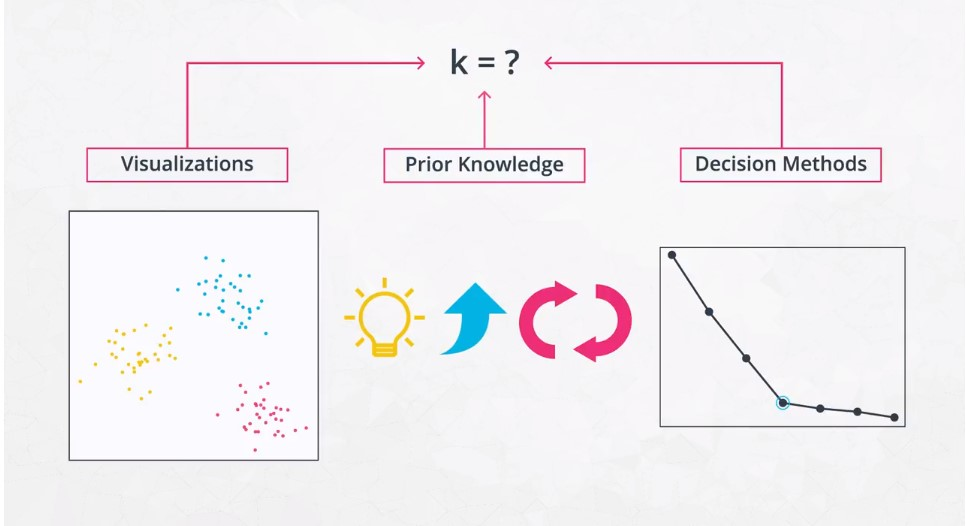
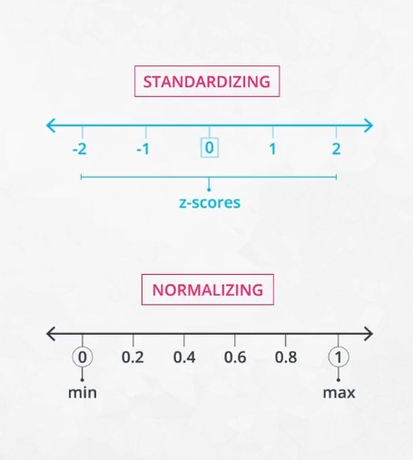
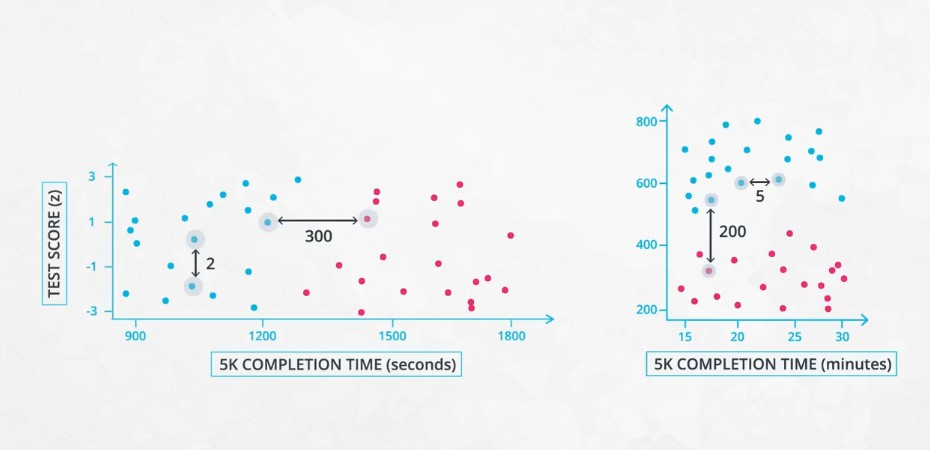

**Unsupervised learning** is all about understanding how to group our data when we either:
1. Do not have a label to predict. An example of this is using an algorithm to look at brain scans to find areas that may raise concern. You don't have labels on the images to understand what areas might raise reason for concern, but you can understand which areas are most similar or different from one another.
2. Are not trying to predict a label, but rather group our data together for some other reason! One example of this is when you have tons of data, and you would like to condense it down to a fewer number of features to be used.

## Types of Unsupervised Learning
There are two popular methods for unsupervised machine learning.
1. **Clustering** - which groups data together based on similarities.

2. **Dimensionality Reduction** - which condenses a large number of features into a (usually much) smaller set of features.

## K-Means
In the K-means algorithm `k` represents the number of clusters you have in your dataset.  
You can choose `k` in different ways:

The [blog by Naftali Harris](https://www.naftaliharris.com/blog/visualizing-k-means-clustering/) is spectacular at showing you how k-means works for a number of situations. You can try it yourself!

In order to assure you have the **best** set of clusters, the K-means algorithm will be performed a few times with different starting points. The best set of clusters is then the clustering that creates the *smallest average distance* from each point to its corresponding centroid.

### Concerns with K-Means

There is some concerns with the k-means algorithm. These concerns included:

1. **Concern**: The random placement of the centroids may lead to non-optimal solutions.  
**Solution** : Run the algorithm multiple times and choose the centroids that create the smallest average distance of the points to the centroids.

2. **Concern**: Depending on the scale of the features, you may end up with different groupings of your points.  
**Solution**: Scale the features using Standardizing, which will create features with mean 0 and standard deviation 1 before running the k-means algorithm.

## Feature Scaling
For any machine learning algorithm that uses *distances* as a part of its optimization, it is important to scale your features.

You saw this earlier in regularized forms of regression like Ridge and Lasso, but it is also true for k-means. In future sections on PCA and ICA, feature scaling will again be important for the successful optimization of your machine learning algorithms.

Though there are a large number of ways that you can go about scaling your features, there are two ways that are most common:
* **Normalizing** or **Max-Min Scaling** - this type of scaling moves variables between `0` and `1`.
* **Standardizing** or **Z-Score Scaling** - this type of scaling creates variables with a mean of `0` and standard deviation of `1`.

This is an example of how feature scaling might change the final Clusters determined by a model.

