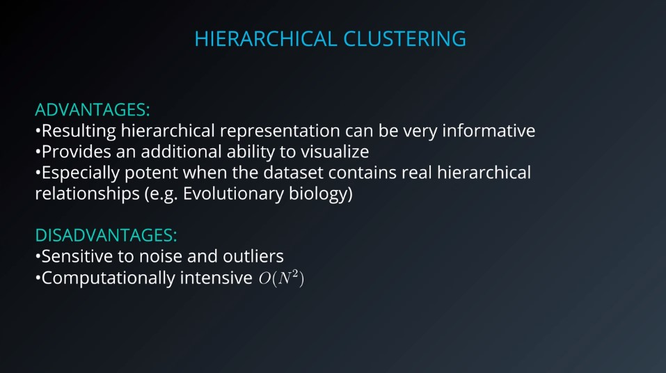
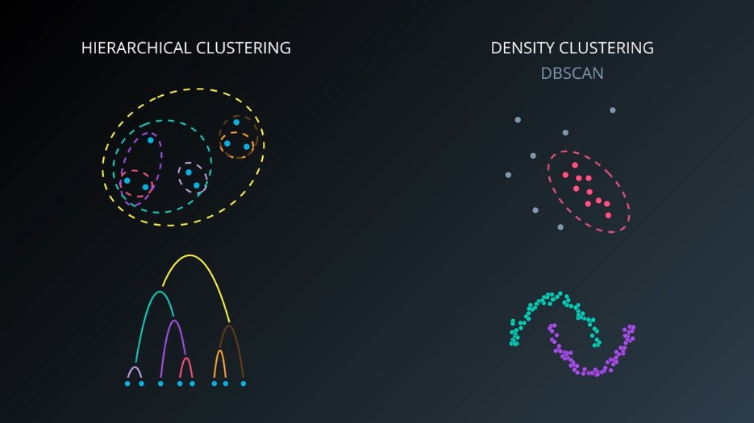
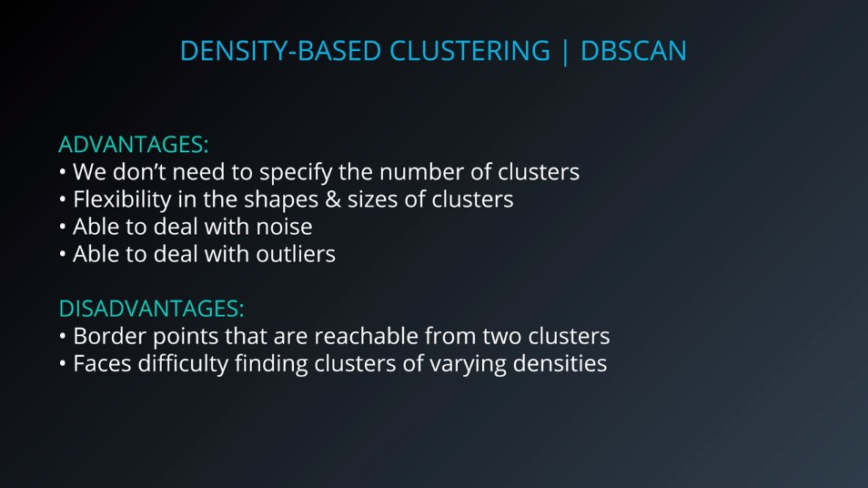

# Hierarchical Clustering

***Hierarchical clustering pros & cons:***

#### Examples:
* **Paper**: [Using Hierarchical Clustering of Secreted Protein Families to Classify and Rank Candidate Effectors of Rust Fungi](http://journals.plos.org/plosone/article?id=10.1371/journal.pone.0029847).

* **Paper**: [Association between composition of the human gastrointestinal microbiome and development of fatty liver with choline deficiency](https://www.ncbi.nlm.nih.gov/pubmed/21129376).

***Hierarchical vs Density Clustering:***

#  Density Based (DBSCAN) Clustering

***DBSCAN pros & cons:***

#### Visualization:

Incredible [Visualization of DBSCAN clustering](https://www.naftaliharris.com/blog/visualizing-dbscan-clustering/). Allows you to change its parameters and see how it works on various datasets. Highly recomended!

#### Examples:

* **Paper**: [Traffic Classification Using Clustering Algorithms](https://pages.cpsc.ucalgary.ca/~mahanti/papers/clustering.pdf).

* **Paper**: [Anomaly detection in temperature data using dbscan algorithm](https://ieeexplore.ieee.org/abstract/document/5946052/).
