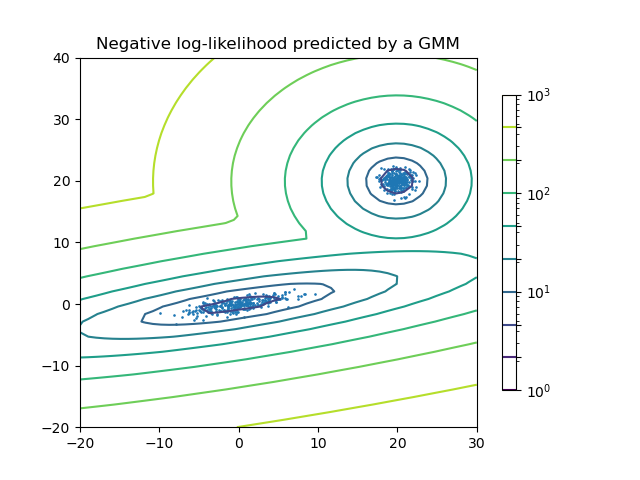
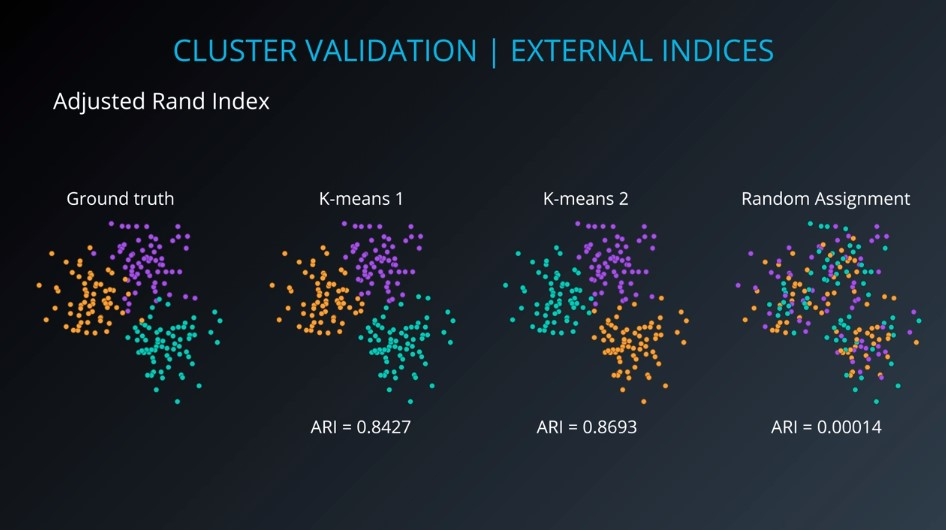

# Gaussian Mixture Models - GMM

A **Gaussian mixture model** is a probabilistic model that assumes all the data points are generated from a mixture of a finite number of Gaussian distributions with unknown parameters.  
One can think of mixture models as generalizing k-means clustering to incorporate information about the covariance structure of the data as well as the centers of the latent Gaussians.

Another example:  

The **[GaussianMixture](https://scikit-learn.org/stable/modules/generated/sklearn.mixture.GaussianMixture.html#sklearn.mixture.GaussianMixture)** object implements the _*[expectation-maximization](https://scikit-learn.org/stable/modules/mixture.html#expectation-maximization)*_ (EM) algorithm for fitting mixture-of-Gaussian models.  

It can also draw confidence ellipsoids for multivariate models, and compute the Bayesian Information Criterion to assess the number of clusters in the data. A *[GaussianMixture.fit](https://scikit-learn.org/stable/modules/generated/sklearn.mixture.GaussianMixture.html#sklearn.mixture.GaussianMixture.fit)* method is provided that learns a Gaussian Mixture Model from train data. Given test data, it can assign to each sample the Gaussian it mostly probably belong to using the *[GaussianMixture.predict](https://scikit-learn.org/stable/modules/generated/sklearn.mixture.GaussianMixture.html#sklearn.mixture.GaussianMixture.predict)* method.  

The **[GaussianMixture](https://scikit-learn.org/stable/modules/generated/sklearn.mixture.GaussianMixture.html#sklearn.mixture.GaussianMixture)** comes with different options to constrain the covariance of the difference classes estimated: `spherical`, `diagonal`, `tied` or `full covariance`.  

### Gaussian Mixture Models pro & cons:

#### Examples:

* **Paper**: [Nonparametric discovery of human routines from sensor data](http://citeseerx.ist.psu.edu/viewdoc/download?doi=10.1.1.681.3152&rep=rep1&type=pdf) [PDf]  
* **Paper**: [Application of the Gaussian mixture model in pulsar astronomy](https://arxiv.org/abs/1205.6221) [PDF]  
* **Paper**: [Speaker Verification Using Adapted Gaussian Mixture Models](http://citeseerx.ist.psu.edu/viewdoc/download?doi=10.1.1.117.338&rep=rep1&type=pdf) [PDF]  
* **Paper**: [Adaptive background mixture models for real-time tracking](http://www.ai.mit.edu/projects/vsam/Publications/stauffer_cvpr98_track.pdf) [PDF]  
* **Video**: https://www.youtube.com/watch?v=lLt9H6RFO6A

---
# Cluster Validation

Categories of cluster validation indices:

1. External indices.
2. Internal indices.
3. Relative indices.

### External Validation Indices

Most of the methods are found in **Sklearn** library:

This is how **Adjusted Rand Index** works:

An example of **ARI**:

* **Paper**: [Details of the Adjusted Rand index](http://faculty.washington.edu/kayee/pca/supp.pdf) (PDF)

### Internal Validation Indices

Some of the methods are found in **Sklearn** library:

This is how **silhouette score** works:  

**Silhouette score** helps us find the best number of clusters, Finding `K`.

We can also used Internal Validation Indices to Compare clustering algorithms.

This final example shows a little bit af down side of similar coefficients.

We should **never** use *silhouette score* with *DBSCAN*. **DBCV** is better!

* **Paper**: [Density-Based Clustering Validation](http://citeseerx.ist.psu.edu/viewdoc/download;jsessionid=83C3BD5E078B1444CB26E243975507E1?doi=10.1.1.707.9034&rep=rep1&type=pdf) (PDF)
