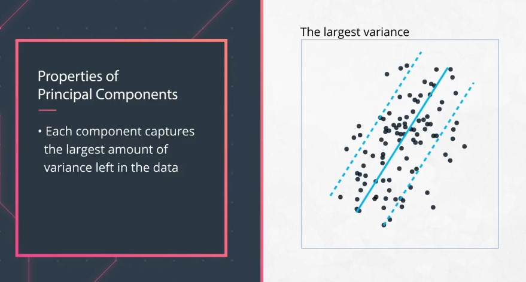

# Principal Components Analysis - PCA

**PCA** is all about: Taking your full dataset and reducing it to only the parts that hold the most information. by finding the directions of maximum variance in high-dimensional data and project it onto a smaller dimensional subspace while retaining most of the information.

### Latent Features

Latent features are features that aren't explicitly in your dataset.

So even if our original dataset has the **12** features listed, we might be able to reduce this to only **2** latent features relating to the *home size* and *home neighborhood*.

But rather than dropping features to reduce the dimensionality in our dataset, what if we were able to combine the features in some way to maximize the amount of information we retain? This is exactly the goal of PCA. Let's take a closer look!

Rather than dropping features to reduce the dimensionality in our dataset, what if we were able to combine the features in some way to maximize the amount of information we retain? This is exactly the goal of PCA. Let's take a closer look!

### Principal Components

1. Principal components are linear combinations of the original features in a dataset that aim to retain the most information in the original data.
2. You can think of a principal component in the same way that you think about a latent feature.

#### Principal Component Properties

There are two main properties of **principal components**:

1. **They retain the most amount of information in the dataset**. the most information in the dataset meant finding a line that reduced the distances of the points to the component across all the points (same as in regression!).

2. **The created components are orthogonal to one another**. So far we have been mostly focused on what the first component of a dataset would look like. However, when there are many components, the additional components will all be orthogonal to one another. Depending on how the components are used, there are benefits to having orthogonal components.  
In regression, we often would like independent features, so using the components in regression now guarantees this.

[This is a great post answering a number of common questions on PCA](https://stats.stackexchange.com/questions/110508/questions-on-pca-when-are-pcs-independent-why-is-pca-sensitive-to-scaling-why).

#### You can also think of a principal component as:
1. linear combination of the original features in a dataset.  
2. latent variable.  
3. a new feature that can be used in a future analysis.  

The amount of information lost when performing PCA can be thought of as **the distance from the original points to the created component**.

### When to Use PCA?

In general, PCA is used to **reduce the dimensionality of your data**. Here are links to some specific use cases beyond what you covered in this lesson:

1. PCA for [microarray data](https://www.ncbi.nlm.nih.gov/pmc/articles/PMC2669932/).  
2. PCA for [anomaly detection](https://arxiv.org/pdf/1801.01571.pdf) (PDF).  
3. PCA for [time series data](http://citeseerx.ist.psu.edu/viewdoc/download?doi=10.1.1.853.2380&rep=rep1&type=pdf) (PDF).

If you ever feel overwhelmed by the amount of data you have, you can look to PCA to reduce the size of your dataset, while still retaining the maximum amount of information (though this does often come at the cost of reducing your data interpretability).

### Interpreting Results

You then saw there were 2 major parts to interpreting the PCA results:

1. The **variance explained** by each component. You were able to visualize this with scree plots to understand how many components you might keep based on how much information was being retained.  
2. The **components** themselves, which gave us an idea of which original features were most related to why a component was able to explain certain aspects about the original datasets.  

---
## The math behind PCA

The mathematics of PCA isn't really necessary for PCA to be useful. However, it can be useful to fully understand the mathematics of a technique to understand how it might be extended to new cases. For this reason, the page has a few additional references which go more into the mathematics of PCA.

A simple introduction of what PCA is aimed to accomplish is provided [here in a simple example](https://www.youtube.com/watch?v=HH8pouRwphA).

A nice visual, and mathematical, illustration of PCA is provided in [this video by 3 blue 1 brown](https://www.youtube.com/watch?v=PFDu9oVAE-g).

If you dive into the literature surrounding PCA, you will without a doubt run into the language of eigenvalues and eigenvectors. These are just the math-y words for things you have already encountered in this lesson.

An eigenvalue is the same as the amount of variability captured by a principal component, and an eigenvector is the principal component itself. To see more on these ideas, take a look at the following three links below:

* [A great introduction into the mathematics of principal components analysis](http://www.cs.otago.ac.nz/cosc453/student_tutorials/principal_components.pdf).  
* [An example of using PCA in python by one of my favorite data scientists](https://sebastianraschka.com/Articles/2015_pca_in_3_steps.html).  
* [An example of PCA from the scikit learn documentation](http://scikit-learn.org/stable/auto_examples/applications/plot_face_recognition.html#sphx-glr-auto-examples-applications-plot-face-recognition-py).  
