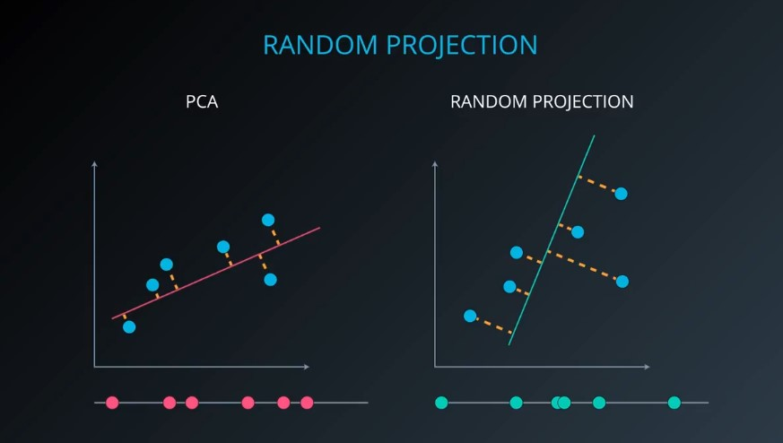

# Random Projection

**[Random projection](https://scikit-learn.org/stable/modules/random_projection.html)** is a technique used to reduce the dimensionality of a set of points which lie in Euclidean space. It's methods are known for their power, simplicity, and low error rates when compared to other methods.

Basic example:

### Random Projection vs PCA

* The number of components is optional and can be computed by the algorithm.  
* When working with so many dimensions that PCA's performance becomes unacceptable for the situation.  

## Random Projection and The [Johnson-Lindenstrauss lemma](https://en.wikipedia.org/wiki/Johnson%E2%80%93Lindenstrauss_lemma)

In mathematics, the *Johnson-Lindenstrauss lemma* is a result concerning low-distortion embeddings of points from high-dimensional into low-dimensional Euclidean space. The lemma states that a small set of points in a high-dimensional space can be embedded into a space of much lower dimension in such a way that distances between the points are nearly preserved. The map used for the embedding is at least *Lipschitz*, and can even be taken to be an orthogonal projection.

Knowing only the number of samples `n`, the `sklearn.random_projection.johnson_lindenstrauss_min_dim` estimates conservatively the minimal size of the random subspace to guarantee a bounded distortion introduced by the random projection.

Example:

### papers

* [Random projection in dimensionality reduction: Applications to image and text data](http://citeseerx.ist.psu.edu/viewdoc/download?doi=10.1.1.76.8124&rep=rep1&type=pdf).  
* [Random Projections for k-means Clustering](https://papers.nips.cc/paper/3901-random-projections-for-k-means-clustering.pdf).  

---
# Independent Component Analysis - ICA

In signal processing, independent component analysis is a computational method for separating a multivariate signal into additive subcomponents. This is done by assuming that:  

1. the subcomponents are **non-Gaussian** signals.   
2. that they are **statistically independent** from each other.  

**ICA** is a special case of blind source separation. A common example application is the "cocktail party problem" of listening in on one person's speech in a noisy room.  

Blind source separation example:

### The music in this this lesson:

* [Cello Suite no. 3 in C, BWV 1009](https://musopen.org/music/43918-cello-suite-no-3-in-c-bwv-1009/) - I. Prelude credit [The Internet Memory Foundation](https://musopen.org/music/performer/european-archive/).  
* [The Carnival of the Animals - XIII. The Swan (Solo piano version)](https://musopen.org/music/1454-the-carnival-of-the-animals/) Credit [Markus Staab](https://musopen.org/music/performer/markus-staab/) License: [CC](https://creativecommons.org/licenses/by/3.0/).  

### papers

* [Independent component analysis: algorithms and applications](http://citeseerx.ist.psu.edu/viewdoc/download?doi=10.1.1.322.679&rep=rep1&type=pdf). [pdf]  
* [Independent Component Analysis of Electroencephalographic Data](http://papers.nips.cc/paper/1091-independent-component-analysis-of-electroencephalographic-data.pdf). [PDF]  
* [Applying Independent Component Analysis to Factor Model in Finance](https://pdfs.semanticscholar.org/a34b/e08a20eba7523600203a32abb026a8dd85a3.pdf). [PDF]  
