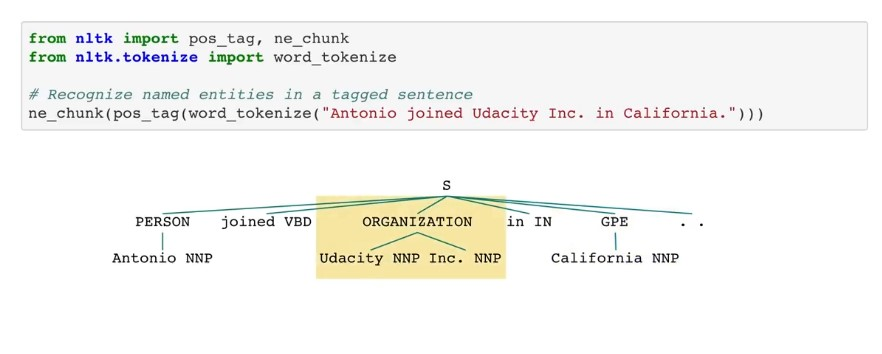
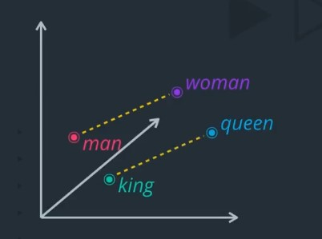
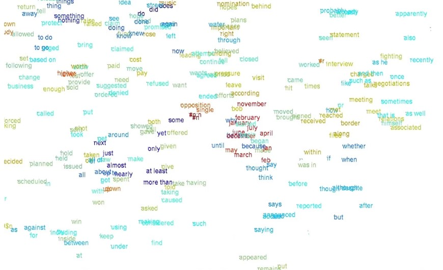

In this lessen we will Learn about text processing, feature extraction, and part-of-speech tagging.

## NLP pipeline:

### Text processing:

In computing, the term text processing refers to the theory and practice of automating the creation or manipulation of electronic text. Text usually refers to all the alphanumeric characters specified on the keyboard of the person engaging the practice, but in general text means the abstraction layer immediately above the standard character encoding of the target text. The term processing refers to automated processing, as opposed to the same manipulation done manually. Text processing involves computer commands which invoke content, content changes, and cursor movement, for example to • search and replace • format • generate a processed report of the content of, or • filter a file or report of a text file. The text processing of a regular expression is a virtual editing machine, having a primitive programming language that has named registers, and named positions in the sequence of characters comprising the text.

### Feature extraction:

In machine learning, pattern recognition and in image processing, feature extraction starts from an initial set of measured data and builds derived values intended to be informative and non-redundant, facilitating the subsequent learning and generalization steps, and in some cases leading to better human interpretations. Feature extraction is related to dimensionality reduction. When the input data to an algorithm is too large to be processed and it is suspected to be redundant, then it can be transformed into a reduced set of features. Determining a subset of the initial features is called feature selection. The selected features are expected to contain the relevant information from the input data, so that the desired task can be performed by using this reduced representation instead of the complete initial data.

### Modeling:

### Part-of-speech tagging

In corpus linguistics, part-of-speech tagging, also called grammatical tagging is the process of marking up a word in a text as corresponding to a particular part of speech, based on both its definition and its context. A simplified form of this is commonly taught to school-age children, in the identification of words as nouns, verbs, adjectives, adverbs, etc. Once performed by hand, POS tagging is now done in the context of computational linguistics, using algorithms which associate discrete terms, as well as hidden parts of speech, by a set of descriptive tags. POS-tagging algorithms fall into two distinctive groups: rule-based and stochastic. E. Brill's tagger, one of the first and most widely used English POS-taggers, employs rule-based algorithms.

### Named-entity recognition

Named-entity recognition is a subtask of information extraction that seeks to locate and classify named entities mentioned in unstructured text into pre-defined categories such as person names, organizations, locations, medical codes, time expressions, quantities, monetary values, percentages, etc. Most research on NER/NEE systems has been structured as taking an unannotated block of text, such as this one: Jim bought 300 shares of Acme Corp. in 2006. And producing an annotated block of text that highlights the names of entities: In this example, a person name consisting of one token, a two-token company name and a temporal expression have been detected and classified. State-of-the-art NER systems for English produce near-human performance. For example, the best system entering MUC-7 scored 93.39% of F-measure while human annotators scored 97.60% and 96.95%.

### Bag-of-words model
The bag-of-words model is a simplifying representation used in natural language processing and information retrieval. In this model, a text is represented as the bag of its words, disregarding grammar and even word order but keeping multiplicity. The bag-of-words model has also been used for computer vision. The bag-of-words model is commonly used in methods of document classification where the occurrence of each word is used as a feature for training a classifier. An early reference to "bag of words" in a linguistic context can be found in Zellig Harris's 1954 article on Distributional Structure.

### TF-IDF

In information retrieval, TF-IDF or TFIDF, short for term frequency–inverse document frequency, is a numerical statistic that is intended to reflect how important a word is to a document in a collection or corpus. It is often used as a weighting factor in searches of information retrieval, text mining, and user modeling. The TF-IDF value increases proportionally to the number of times a word appears in the document and is offset by the number of documents in the corpus that contain the word, which helps to adjust for the fact that some words appear more frequently in general. TF-IDF is one of the most popular term-weighting schemes today. A survey conducted in 2015 showed that 83% of text-based recommender systems in digital libraries use TF-IDF. Variations of the TF-IDF weighting scheme are often used by search engines as a central tool in scoring and ranking a document's relevance given a user query.

### One-hot Encoding
In digital circuits and machine learning, a one-hot is a group of bits among which the legal combinations of values are only those with a single high bit and all the others low. A similar implementation in which all bits are '1' except one '0' is sometimes called one-cold. In statistics, dummy variables represent a similar technique for representing categorical data.

### Word embedding

Word embedding is any of a set of language modeling and feature learning techniques in natural language processing where words or phrases from the vocabulary are mapped to vectors of real numbers. Conceptually it involves a mathematical embedding from a space with many dimensions per word to a continuous vector space with a much lower dimension. Methods to generate this mapping include neural networks, dimensionality reduction on the word co-occurrence matrix, probabilistic models, explainable knowledge base method, and explicit representation in terms of the context in which words appear. Word and phrase embeddings, when used as the underlying input representation, have been shown to boost the performance in NLP tasks such as syntactic parsing and sentiment analysis.

### T-SNE

t-distributed stochastic neighbor embedding is a machine learning algorithm for visualization based on Stochastic Neighbor Embedding originally developed by Sam Roweis and Geoffrey Hinton, where Laurens van der Maaten proposed the t-distributed variant. It is a nonlinear dimensionality reduction technique well-suited for embedding high-dimensional data for visualization in a low-dimensional space of two or three dimensions. Specifically, it models each high-dimensional object by a two- or three-dimensional point in such a way that similar objects are modeled by nearby points and dissimilar objects are modeled by distant points with high probability. The t-SNE algorithm comprises two main stages. First, t-SNE constructs a probability distribution over pairs of high-dimensional objects in such a way that similar objects are assigned a higher probability while dissimilar points are assigned a lower probability.

#### INSTRUCTOR NOTE:

- Source: https://en.wikipedia.org/wiki/Kingfisher
- WordNet visualization tool: http://mateogianolio.com/wordnet-visualization/
